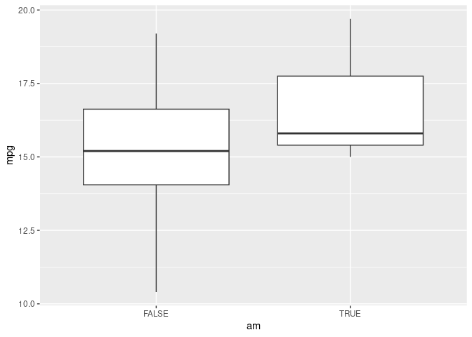

R: Lectura de datos
================
Abraham Jaimes

# Datos

## Tamaño de los datos

``` r
nrow(iris)
#> [1] 150
ncol(iris)
#> [1] 5
dim(iris)
#> [1] 150   5
nrow(ggplot2::diamonds)
#> [1] 53940
```

## Guardado de datos

``` r
write.csv(iris, "~/Descargas/iris.csv", row.names = FALSE)
write.csv(ggplot2::diamonds, "~/Descargas/diamonds.csv", row.names = FALSE)
zip("~/Descargas/iris.zip", normalizePath("~/Descargas/iris.csv"))
```

# Lectura

## Base R

``` r
read.csv("~/Descargas/iris.csv")
#>     Sepal.Length Sepal.Width Petal.Length Petal.Width    Species
#> 1            5.1         3.5          1.4         0.2     setosa
#> 2            4.9         3.0          1.4         0.2     setosa
#> 3            4.7         3.2          1.3         0.2     setosa
#> 4            4.6         3.1          1.5         0.2     setosa
#> 5            5.0         3.6          1.4         0.2     setosa
#> 6            5.4         3.9          1.7         0.4     setosa
#> 7            4.6         3.4          1.4         0.3     setosa
#> 8            5.0         3.4          1.5         0.2     setosa
#> 9            4.4         2.9          1.4         0.2     setosa
#> 10           4.9         3.1          1.5         0.1     setosa
#> 11           5.4         3.7          1.5         0.2     setosa
#> 12           4.8         3.4          1.6         0.2     setosa
#> 13           4.8         3.0          1.4         0.1     setosa
#> 14           4.3         3.0          1.1         0.1     setosa
#> 15           5.8         4.0          1.2         0.2     setosa
#> 16           5.7         4.4          1.5         0.4     setosa
#> 17           5.4         3.9          1.3         0.4     setosa
#> 18           5.1         3.5          1.4         0.3     setosa
#> 19           5.7         3.8          1.7         0.3     setosa
#> 20           5.1         3.8          1.5         0.3     setosa
#> 21           5.4         3.4          1.7         0.2     setosa
#> 22           5.1         3.7          1.5         0.4     setosa
#> 23           4.6         3.6          1.0         0.2     setosa
#> 24           5.1         3.3          1.7         0.5     setosa
#> 25           4.8         3.4          1.9         0.2     setosa
#> 26           5.0         3.0          1.6         0.2     setosa
#> 27           5.0         3.4          1.6         0.4     setosa
#> 28           5.2         3.5          1.5         0.2     setosa
#> 29           5.2         3.4          1.4         0.2     setosa
#> 30           4.7         3.2          1.6         0.2     setosa
#> 31           4.8         3.1          1.6         0.2     setosa
#> 32           5.4         3.4          1.5         0.4     setosa
#> 33           5.2         4.1          1.5         0.1     setosa
#> 34           5.5         4.2          1.4         0.2     setosa
#> 35           4.9         3.1          1.5         0.2     setosa
#> 36           5.0         3.2          1.2         0.2     setosa
#> 37           5.5         3.5          1.3         0.2     setosa
#> 38           4.9         3.6          1.4         0.1     setosa
#> 39           4.4         3.0          1.3         0.2     setosa
#> 40           5.1         3.4          1.5         0.2     setosa
#> 41           5.0         3.5          1.3         0.3     setosa
#> 42           4.5         2.3          1.3         0.3     setosa
#> 43           4.4         3.2          1.3         0.2     setosa
#> 44           5.0         3.5          1.6         0.6     setosa
#> 45           5.1         3.8          1.9         0.4     setosa
#> 46           4.8         3.0          1.4         0.3     setosa
#> 47           5.1         3.8          1.6         0.2     setosa
#> 48           4.6         3.2          1.4         0.2     setosa
#> 49           5.3         3.7          1.5         0.2     setosa
#> 50           5.0         3.3          1.4         0.2     setosa
#> 51           7.0         3.2          4.7         1.4 versicolor
#> 52           6.4         3.2          4.5         1.5 versicolor
#> 53           6.9         3.1          4.9         1.5 versicolor
#> 54           5.5         2.3          4.0         1.3 versicolor
#> 55           6.5         2.8          4.6         1.5 versicolor
#> 56           5.7         2.8          4.5         1.3 versicolor
#> 57           6.3         3.3          4.7         1.6 versicolor
#> 58           4.9         2.4          3.3         1.0 versicolor
#> 59           6.6         2.9          4.6         1.3 versicolor
#> 60           5.2         2.7          3.9         1.4 versicolor
#> 61           5.0         2.0          3.5         1.0 versicolor
#> 62           5.9         3.0          4.2         1.5 versicolor
#> 63           6.0         2.2          4.0         1.0 versicolor
#> 64           6.1         2.9          4.7         1.4 versicolor
#> 65           5.6         2.9          3.6         1.3 versicolor
#> 66           6.7         3.1          4.4         1.4 versicolor
#> 67           5.6         3.0          4.5         1.5 versicolor
#> 68           5.8         2.7          4.1         1.0 versicolor
#> 69           6.2         2.2          4.5         1.5 versicolor
#> 70           5.6         2.5          3.9         1.1 versicolor
#> 71           5.9         3.2          4.8         1.8 versicolor
#> 72           6.1         2.8          4.0         1.3 versicolor
#> 73           6.3         2.5          4.9         1.5 versicolor
#> 74           6.1         2.8          4.7         1.2 versicolor
#> 75           6.4         2.9          4.3         1.3 versicolor
#> 76           6.6         3.0          4.4         1.4 versicolor
#> 77           6.8         2.8          4.8         1.4 versicolor
#> 78           6.7         3.0          5.0         1.7 versicolor
#> 79           6.0         2.9          4.5         1.5 versicolor
#> 80           5.7         2.6          3.5         1.0 versicolor
#> 81           5.5         2.4          3.8         1.1 versicolor
#> 82           5.5         2.4          3.7         1.0 versicolor
#> 83           5.8         2.7          3.9         1.2 versicolor
#> 84           6.0         2.7          5.1         1.6 versicolor
#> 85           5.4         3.0          4.5         1.5 versicolor
#> 86           6.0         3.4          4.5         1.6 versicolor
#> 87           6.7         3.1          4.7         1.5 versicolor
#> 88           6.3         2.3          4.4         1.3 versicolor
#> 89           5.6         3.0          4.1         1.3 versicolor
#> 90           5.5         2.5          4.0         1.3 versicolor
#> 91           5.5         2.6          4.4         1.2 versicolor
#> 92           6.1         3.0          4.6         1.4 versicolor
#> 93           5.8         2.6          4.0         1.2 versicolor
#> 94           5.0         2.3          3.3         1.0 versicolor
#> 95           5.6         2.7          4.2         1.3 versicolor
#> 96           5.7         3.0          4.2         1.2 versicolor
#> 97           5.7         2.9          4.2         1.3 versicolor
#> 98           6.2         2.9          4.3         1.3 versicolor
#> 99           5.1         2.5          3.0         1.1 versicolor
#> 100          5.7         2.8          4.1         1.3 versicolor
#> 101          6.3         3.3          6.0         2.5  virginica
#> 102          5.8         2.7          5.1         1.9  virginica
#> 103          7.1         3.0          5.9         2.1  virginica
#> 104          6.3         2.9          5.6         1.8  virginica
#> 105          6.5         3.0          5.8         2.2  virginica
#> 106          7.6         3.0          6.6         2.1  virginica
#> 107          4.9         2.5          4.5         1.7  virginica
#> 108          7.3         2.9          6.3         1.8  virginica
#> 109          6.7         2.5          5.8         1.8  virginica
#> 110          7.2         3.6          6.1         2.5  virginica
#> 111          6.5         3.2          5.1         2.0  virginica
#> 112          6.4         2.7          5.3         1.9  virginica
#> 113          6.8         3.0          5.5         2.1  virginica
#> 114          5.7         2.5          5.0         2.0  virginica
#> 115          5.8         2.8          5.1         2.4  virginica
#> 116          6.4         3.2          5.3         2.3  virginica
#> 117          6.5         3.0          5.5         1.8  virginica
#> 118          7.7         3.8          6.7         2.2  virginica
#> 119          7.7         2.6          6.9         2.3  virginica
#> 120          6.0         2.2          5.0         1.5  virginica
#> 121          6.9         3.2          5.7         2.3  virginica
#> 122          5.6         2.8          4.9         2.0  virginica
#> 123          7.7         2.8          6.7         2.0  virginica
#> 124          6.3         2.7          4.9         1.8  virginica
#> 125          6.7         3.3          5.7         2.1  virginica
#> 126          7.2         3.2          6.0         1.8  virginica
#> 127          6.2         2.8          4.8         1.8  virginica
#> 128          6.1         3.0          4.9         1.8  virginica
#> 129          6.4         2.8          5.6         2.1  virginica
#> 130          7.2         3.0          5.8         1.6  virginica
#> 131          7.4         2.8          6.1         1.9  virginica
#> 132          7.9         3.8          6.4         2.0  virginica
#> 133          6.4         2.8          5.6         2.2  virginica
#> 134          6.3         2.8          5.1         1.5  virginica
#> 135          6.1         2.6          5.6         1.4  virginica
#> 136          7.7         3.0          6.1         2.3  virginica
#> 137          6.3         3.4          5.6         2.4  virginica
#> 138          6.4         3.1          5.5         1.8  virginica
#> 139          6.0         3.0          4.8         1.8  virginica
#> 140          6.9         3.1          5.4         2.1  virginica
#> 141          6.7         3.1          5.6         2.4  virginica
#> 142          6.9         3.1          5.1         2.3  virginica
#> 143          5.8         2.7          5.1         1.9  virginica
#> 144          6.8         3.2          5.9         2.3  virginica
#> 145          6.7         3.3          5.7         2.5  virginica
#> 146          6.7         3.0          5.2         2.3  virginica
#> 147          6.3         2.5          5.0         1.9  virginica
#> 148          6.5         3.0          5.2         2.0  virginica
#> 149          6.2         3.4          5.4         2.3  virginica
#> 150          5.9         3.0          5.1         1.8  virginica
```

## `data.table`

``` r
library(data.table)
```

``` r
fread("~/Descargas/iris.csv")
#>      Sepal.Length Sepal.Width Petal.Length Petal.Width   Species
#>   1:          5.1         3.5          1.4         0.2    setosa
#>   2:          4.9         3.0          1.4         0.2    setosa
#>   3:          4.7         3.2          1.3         0.2    setosa
#>   4:          4.6         3.1          1.5         0.2    setosa
#>   5:          5.0         3.6          1.4         0.2    setosa
#>  ---                                                            
#> 146:          6.7         3.0          5.2         2.3 virginica
#> 147:          6.3         2.5          5.0         1.9 virginica
#> 148:          6.5         3.0          5.2         2.0 virginica
#> 149:          6.2         3.4          5.4         2.3 virginica
#> 150:          5.9         3.0          5.1         1.8 virginica
```

## Benchmark

``` r
library(microbenchmark)
```

### Pocos datos

``` r
microbenchmark(base = read.csv("~/Descargas/iris.csv"),
               data_table = fread("~/Descargas/iris.csv"), 
               times = 20)
#> Unit: microseconds
#>        expr     min       lq     mean   median      uq     max neval
#>        base 256.781 270.3740 286.2731 279.5945 291.690 405.902    20
#>  data_table 200.883 218.0085 240.3334 228.2330 243.343 449.068    20
```

### Muchos datos

``` r
microbenchmark(base = read.csv("~/Descargas/diamonds.csv"),
               data_table = fread("~/Descargas/diamonds.csv"),
               times = 20)
#> Unit: milliseconds
#>        expr       min        lq      mean    median        uq       max neval
#>        base 61.996832 62.864432 64.260218 64.468604 65.063115 68.154877    20
#>  data_table  7.091948  7.480285  8.140278  7.762783  8.838193  9.882409    20
```

### Ejemplos avanzados `fread`

#### input

``` r
fread(input = "date, count
2022-12-27 00:00:00,     0
2022-12-27 00:01:00,     0
2023-01-03 00:00:00,     0
2023-01-03 00:01:00,     0
2023-01-10 00:00:00,     0
2023-01-10 00:01:00,     0
2023-01-17 00:00:00,     1
2023-01-17 00:01:00,     0")
#>                   date count
#> 1: 2022-12-27 00:00:00     0
#> 2: 2022-12-27 00:01:00     0
#> 3: 2023-01-03 00:00:00     0
#> 4: 2023-01-03 00:01:00     0
#> 5: 2023-01-10 00:00:00     0
#> 6: 2023-01-10 00:01:00     0
#> 7: 2023-01-17 00:00:00     1
#> 8: 2023-01-17 00:01:00     0
```

``` r
fread(text = "date, count
2022-12-27 00:00:00,     0
2022-12-27 00:01:00,     0
2023-01-03 00:00:00,     0
2023-01-03 00:01:00,     0
2023-01-10 00:00:00,     0
2023-01-10 00:01:00,     0
2023-01-17 00:00:00,     1
2023-01-17 00:01:00,     0")
#>                   date count
#> 1: 2022-12-27 00:00:00     0
#> 2: 2022-12-27 00:01:00     0
#> 3: 2023-01-03 00:00:00     0
#> 4: 2023-01-03 00:01:00     0
#> 5: 2023-01-10 00:00:00     0
#> 6: 2023-01-10 00:01:00     0
#> 7: 2023-01-17 00:00:00     1
#> 8: 2023-01-17 00:01:00     0
```

``` r
fread("unzip -p ~/Descargas/iris.zip")
#>      Sepal.Length Sepal.Width Petal.Length Petal.Width   Species
#>   1:          5.1         3.5          1.4         0.2    setosa
#>   2:          4.9         3.0          1.4         0.2    setosa
#>   3:          4.7         3.2          1.3         0.2    setosa
#>   4:          4.6         3.1          1.5         0.2    setosa
#>   5:          5.0         3.6          1.4         0.2    setosa
#>  ---                                                            
#> 146:          6.7         3.0          5.2         2.3 virginica
#> 147:          6.3         2.5          5.0         1.9 virginica
#> 148:          6.5         3.0          5.2         2.0 virginica
#> 149:          6.2         3.4          5.4         2.3 virginica
#> 150:          5.9         3.0          5.1         1.8 virginica
```

``` r
fread(cmd = "unzip -p ~/Descargas/iris.zip")
#>      Sepal.Length Sepal.Width Petal.Length Petal.Width   Species
#>   1:          5.1         3.5          1.4         0.2    setosa
#>   2:          4.9         3.0          1.4         0.2    setosa
#>   3:          4.7         3.2          1.3         0.2    setosa
#>   4:          4.6         3.1          1.5         0.2    setosa
#>   5:          5.0         3.6          1.4         0.2    setosa
#>  ---                                                            
#> 146:          6.7         3.0          5.2         2.3 virginica
#> 147:          6.3         2.5          5.0         1.9 virginica
#> 148:          6.5         3.0          5.2         2.0 virginica
#> 149:          6.2         3.4          5.4         2.3 virginica
#> 150:          5.9         3.0          5.1         1.8 virginica
```

``` r
fread("~/Descargas/iris.csv")
#>      Sepal.Length Sepal.Width Petal.Length Petal.Width   Species
#>   1:          5.1         3.5          1.4         0.2    setosa
#>   2:          4.9         3.0          1.4         0.2    setosa
#>   3:          4.7         3.2          1.3         0.2    setosa
#>   4:          4.6         3.1          1.5         0.2    setosa
#>   5:          5.0         3.6          1.4         0.2    setosa
#>  ---                                                            
#> 146:          6.7         3.0          5.2         2.3 virginica
#> 147:          6.3         2.5          5.0         1.9 virginica
#> 148:          6.5         3.0          5.2         2.0 virginica
#> 149:          6.2         3.4          5.4         2.3 virginica
#> 150:          5.9         3.0          5.1         1.8 virginica
```

``` r
fread(file = "~/Descargas/iris.csv")
#>      Sepal.Length Sepal.Width Petal.Length Petal.Width   Species
#>   1:          5.1         3.5          1.4         0.2    setosa
#>   2:          4.9         3.0          1.4         0.2    setosa
#>   3:          4.7         3.2          1.3         0.2    setosa
#>   4:          4.6         3.1          1.5         0.2    setosa
#>   5:          5.0         3.6          1.4         0.2    setosa
#>  ---                                                            
#> 146:          6.7         3.0          5.2         2.3 virginica
#> 147:          6.3         2.5          5.0         1.9 virginica
#> 148:          6.5         3.0          5.2         2.0 virginica
#> 149:          6.2         3.4          5.4         2.3 virginica
#> 150:          5.9         3.0          5.1         1.8 virginica
```

#### cmd

``` r
fread(cmd = paste("grep", "setosa", "~/Descargas/iris.csv"))
#>      V1  V2  V3  V4     V5
#>  1: 5.1 3.5 1.4 0.2 setosa
#>  2: 4.9 3.0 1.4 0.2 setosa
#>  3: 4.7 3.2 1.3 0.2 setosa
#>  4: 4.6 3.1 1.5 0.2 setosa
#>  5: 5.0 3.6 1.4 0.2 setosa
#>  6: 5.4 3.9 1.7 0.4 setosa
#>  7: 4.6 3.4 1.4 0.3 setosa
#>  8: 5.0 3.4 1.5 0.2 setosa
#>  9: 4.4 2.9 1.4 0.2 setosa
#> 10: 4.9 3.1 1.5 0.1 setosa
#> 11: 5.4 3.7 1.5 0.2 setosa
#> 12: 4.8 3.4 1.6 0.2 setosa
#> 13: 4.8 3.0 1.4 0.1 setosa
#> 14: 4.3 3.0 1.1 0.1 setosa
#> 15: 5.8 4.0 1.2 0.2 setosa
#> 16: 5.7 4.4 1.5 0.4 setosa
#> 17: 5.4 3.9 1.3 0.4 setosa
#> 18: 5.1 3.5 1.4 0.3 setosa
#> 19: 5.7 3.8 1.7 0.3 setosa
#> 20: 5.1 3.8 1.5 0.3 setosa
#> 21: 5.4 3.4 1.7 0.2 setosa
#> 22: 5.1 3.7 1.5 0.4 setosa
#> 23: 4.6 3.6 1.0 0.2 setosa
#> 24: 5.1 3.3 1.7 0.5 setosa
#> 25: 4.8 3.4 1.9 0.2 setosa
#> 26: 5.0 3.0 1.6 0.2 setosa
#> 27: 5.0 3.4 1.6 0.4 setosa
#> 28: 5.2 3.5 1.5 0.2 setosa
#> 29: 5.2 3.4 1.4 0.2 setosa
#> 30: 4.7 3.2 1.6 0.2 setosa
#> 31: 4.8 3.1 1.6 0.2 setosa
#> 32: 5.4 3.4 1.5 0.4 setosa
#> 33: 5.2 4.1 1.5 0.1 setosa
#> 34: 5.5 4.2 1.4 0.2 setosa
#> 35: 4.9 3.1 1.5 0.2 setosa
#> 36: 5.0 3.2 1.2 0.2 setosa
#> 37: 5.5 3.5 1.3 0.2 setosa
#> 38: 4.9 3.6 1.4 0.1 setosa
#> 39: 4.4 3.0 1.3 0.2 setosa
#> 40: 5.1 3.4 1.5 0.2 setosa
#> 41: 5.0 3.5 1.3 0.3 setosa
#> 42: 4.5 2.3 1.3 0.3 setosa
#> 43: 4.4 3.2 1.3 0.2 setosa
#> 44: 5.0 3.5 1.6 0.6 setosa
#> 45: 5.1 3.8 1.9 0.4 setosa
#> 46: 4.8 3.0 1.4 0.3 setosa
#> 47: 5.1 3.8 1.6 0.2 setosa
#> 48: 4.6 3.2 1.4 0.2 setosa
#> 49: 5.3 3.7 1.5 0.2 setosa
#> 50: 5.0 3.3 1.4 0.2 setosa
#>      V1  V2  V3  V4     V5
```

``` r
fread(cmd = "unzip -p ~/Descargas/iris.zip")
#>      Sepal.Length Sepal.Width Petal.Length Petal.Width   Species
#>   1:          5.1         3.5          1.4         0.2    setosa
#>   2:          4.9         3.0          1.4         0.2    setosa
#>   3:          4.7         3.2          1.3         0.2    setosa
#>   4:          4.6         3.1          1.5         0.2    setosa
#>   5:          5.0         3.6          1.4         0.2    setosa
#>  ---                                                            
#> 146:          6.7         3.0          5.2         2.3 virginica
#> 147:          6.3         2.5          5.0         1.9 virginica
#> 148:          6.5         3.0          5.2         2.0 virginica
#> 149:          6.2         3.4          5.4         2.3 virginica
#> 150:          5.9         3.0          5.1         1.8 virginica
```

#### `nrows` y `select`

``` r
fread("~/Descargas/iris.csv", nrows = 3, select = c(1, 2))
#>    Sepal.Length Sepal.Width
#> 1:          5.1         3.5
#> 2:          4.9         3.0
#> 3:          4.7         3.2
fread("~/Descargas/iris.csv", nrows = 3, select = c("Sepal.Length", "Species"))
#>    Sepal.Length Species
#> 1:          5.1  setosa
#> 2:          4.9  setosa
#> 3:          4.7  setosa
```

#### `skip`

``` r
fread("~/Descargas/iris.csv", skip = 100)
#>      V1  V2  V3  V4         V5
#>  1: 5.7 2.8 4.1 1.3 versicolor
#>  2: 6.3 3.3 6.0 2.5  virginica
#>  3: 5.8 2.7 5.1 1.9  virginica
#>  4: 7.1 3.0 5.9 2.1  virginica
#>  5: 6.3 2.9 5.6 1.8  virginica
#>  6: 6.5 3.0 5.8 2.2  virginica
#>  7: 7.6 3.0 6.6 2.1  virginica
#>  8: 4.9 2.5 4.5 1.7  virginica
#>  9: 7.3 2.9 6.3 1.8  virginica
#> 10: 6.7 2.5 5.8 1.8  virginica
#> 11: 7.2 3.6 6.1 2.5  virginica
#> 12: 6.5 3.2 5.1 2.0  virginica
#> 13: 6.4 2.7 5.3 1.9  virginica
#> 14: 6.8 3.0 5.5 2.1  virginica
#> 15: 5.7 2.5 5.0 2.0  virginica
#> 16: 5.8 2.8 5.1 2.4  virginica
#> 17: 6.4 3.2 5.3 2.3  virginica
#> 18: 6.5 3.0 5.5 1.8  virginica
#> 19: 7.7 3.8 6.7 2.2  virginica
#> 20: 7.7 2.6 6.9 2.3  virginica
#> 21: 6.0 2.2 5.0 1.5  virginica
#> 22: 6.9 3.2 5.7 2.3  virginica
#> 23: 5.6 2.8 4.9 2.0  virginica
#> 24: 7.7 2.8 6.7 2.0  virginica
#> 25: 6.3 2.7 4.9 1.8  virginica
#> 26: 6.7 3.3 5.7 2.1  virginica
#> 27: 7.2 3.2 6.0 1.8  virginica
#> 28: 6.2 2.8 4.8 1.8  virginica
#> 29: 6.1 3.0 4.9 1.8  virginica
#> 30: 6.4 2.8 5.6 2.1  virginica
#> 31: 7.2 3.0 5.8 1.6  virginica
#> 32: 7.4 2.8 6.1 1.9  virginica
#> 33: 7.9 3.8 6.4 2.0  virginica
#> 34: 6.4 2.8 5.6 2.2  virginica
#> 35: 6.3 2.8 5.1 1.5  virginica
#> 36: 6.1 2.6 5.6 1.4  virginica
#> 37: 7.7 3.0 6.1 2.3  virginica
#> 38: 6.3 3.4 5.6 2.4  virginica
#> 39: 6.4 3.1 5.5 1.8  virginica
#> 40: 6.0 3.0 4.8 1.8  virginica
#> 41: 6.9 3.1 5.4 2.1  virginica
#> 42: 6.7 3.1 5.6 2.4  virginica
#> 43: 6.9 3.1 5.1 2.3  virginica
#> 44: 5.8 2.7 5.1 1.9  virginica
#> 45: 6.8 3.2 5.9 2.3  virginica
#> 46: 6.7 3.3 5.7 2.5  virginica
#> 47: 6.7 3.0 5.2 2.3  virginica
#> 48: 6.3 2.5 5.0 1.9  virginica
#> 49: 6.5 3.0 5.2 2.0  virginica
#> 50: 6.2 3.4 5.4 2.3  virginica
#> 51: 5.9 3.0 5.1 1.8  virginica
#>      V1  V2  V3  V4         V5
fread("~/Descargas/iris.csv", skip = "Sepal.Length")
#>      Sepal.Length Sepal.Width Petal.Length Petal.Width   Species
#>   1:          5.1         3.5          1.4         0.2    setosa
#>   2:          4.9         3.0          1.4         0.2    setosa
#>   3:          4.7         3.2          1.3         0.2    setosa
#>   4:          4.6         3.1          1.5         0.2    setosa
#>   5:          5.0         3.6          1.4         0.2    setosa
#>  ---                                                            
#> 146:          6.7         3.0          5.2         2.3 virginica
#> 147:          6.3         2.5          5.0         1.9 virginica
#> 148:          6.5         3.0          5.2         2.0 virginica
#> 149:          6.2         3.4          5.4         2.3 virginica
#> 150:          5.9         3.0          5.1         1.8 virginica
```

## Tidyverse

### readxl

``` r
library(readxl)
```

``` r
datasets <- readxl_example("datasets.xlsx")
read_excel(datasets)
#> # A tibble: 150 × 5
#>    Sepal.Length Sepal.Width Petal.Length Petal.Width Species
#>           <dbl>       <dbl>        <dbl>       <dbl> <chr>  
#>  1          5.1         3.5          1.4         0.2 setosa 
#>  2          4.9         3            1.4         0.2 setosa 
#>  3          4.7         3.2          1.3         0.2 setosa 
#>  4          4.6         3.1          1.5         0.2 setosa 
#>  5          5           3.6          1.4         0.2 setosa 
#>  6          5.4         3.9          1.7         0.4 setosa 
#>  7          4.6         3.4          1.4         0.3 setosa 
#>  8          5           3.4          1.5         0.2 setosa 
#>  9          4.4         2.9          1.4         0.2 setosa 
#> 10          4.9         3.1          1.5         0.1 setosa 
#> # … with 140 more rows

# Specify sheet either by position or by name
read_excel(datasets, 2)
#> # A tibble: 32 × 11
#>      mpg   cyl  disp    hp  drat    wt  qsec    vs    am  gear  carb
#>    <dbl> <dbl> <dbl> <dbl> <dbl> <dbl> <dbl> <dbl> <dbl> <dbl> <dbl>
#>  1  21       6  160    110  3.9   2.62  16.5     0     1     4     4
#>  2  21       6  160    110  3.9   2.88  17.0     0     1     4     4
#>  3  22.8     4  108     93  3.85  2.32  18.6     1     1     4     1
#>  4  21.4     6  258    110  3.08  3.22  19.4     1     0     3     1
#>  5  18.7     8  360    175  3.15  3.44  17.0     0     0     3     2
#>  6  18.1     6  225    105  2.76  3.46  20.2     1     0     3     1
#>  7  14.3     8  360    245  3.21  3.57  15.8     0     0     3     4
#>  8  24.4     4  147.    62  3.69  3.19  20       1     0     4     2
#>  9  22.8     4  141.    95  3.92  3.15  22.9     1     0     4     2
#> 10  19.2     6  168.   123  3.92  3.44  18.3     1     0     4     4
#> # … with 22 more rows
read_excel(datasets, "mtcars")
#> # A tibble: 32 × 11
#>      mpg   cyl  disp    hp  drat    wt  qsec    vs    am  gear  carb
#>    <dbl> <dbl> <dbl> <dbl> <dbl> <dbl> <dbl> <dbl> <dbl> <dbl> <dbl>
#>  1  21       6  160    110  3.9   2.62  16.5     0     1     4     4
#>  2  21       6  160    110  3.9   2.88  17.0     0     1     4     4
#>  3  22.8     4  108     93  3.85  2.32  18.6     1     1     4     1
#>  4  21.4     6  258    110  3.08  3.22  19.4     1     0     3     1
#>  5  18.7     8  360    175  3.15  3.44  17.0     0     0     3     2
#>  6  18.1     6  225    105  2.76  3.46  20.2     1     0     3     1
#>  7  14.3     8  360    245  3.21  3.57  15.8     0     0     3     4
#>  8  24.4     4  147.    62  3.69  3.19  20       1     0     4     2
#>  9  22.8     4  141.    95  3.92  3.15  22.9     1     0     4     2
#> 10  19.2     6  168.   123  3.92  3.44  18.3     1     0     4     4
#> # … with 22 more rows

# Skip rows and use default column names
read_excel(datasets, skip = 148, col_names = FALSE)
#> New names:
#> • `` -> `...1`
#> • `` -> `...2`
#> • `` -> `...3`
#> • `` -> `...4`
#> • `` -> `...5`
#> # A tibble: 3 × 5
#>    ...1  ...2  ...3  ...4 ...5     
#>   <dbl> <dbl> <dbl> <dbl> <chr>    
#> 1   6.5   3     5.2   2   virginica
#> 2   6.2   3.4   5.4   2.3 virginica
#> 3   5.9   3     5.1   1.8 virginica

# Recycle a single column type
read_excel(datasets, col_types = "text")
#> # A tibble: 150 × 5
#>    Sepal.Length Sepal.Width Petal.Length Petal.Width Species
#>    <chr>        <chr>       <chr>        <chr>       <chr>  
#>  1 5.1          3.5         1.4          0.2         setosa 
#>  2 4.9          3           1.4          0.2         setosa 
#>  3 4.7          3.2         1.3          0.2         setosa 
#>  4 4.6          3.1         1.5          0.2         setosa 
#>  5 5            3.6         1.4          0.2         setosa 
#>  6 5.4          3.9         1.7          0.4         setosa 
#>  7 4.6          3.4         1.4          0.3         setosa 
#>  8 5            3.4         1.5          0.2         setosa 
#>  9 4.4          2.9         1.4          0.2         setosa 
#> 10 4.9          3.1         1.5          0.1         setosa 
#> # … with 140 more rows

# Specify some col_types and guess others
read_excel(datasets, col_types = c("text", "guess", "numeric", "guess", "guess"))
#> # A tibble: 150 × 5
#>    Sepal.Length Sepal.Width Petal.Length Petal.Width Species
#>    <chr>              <dbl>        <dbl>       <dbl> <chr>  
#>  1 5.1                  3.5          1.4         0.2 setosa 
#>  2 4.9                  3            1.4         0.2 setosa 
#>  3 4.7                  3.2          1.3         0.2 setosa 
#>  4 4.6                  3.1          1.5         0.2 setosa 
#>  5 5                    3.6          1.4         0.2 setosa 
#>  6 5.4                  3.9          1.7         0.4 setosa 
#>  7 4.6                  3.4          1.4         0.3 setosa 
#>  8 5                    3.4          1.5         0.2 setosa 
#>  9 4.4                  2.9          1.4         0.2 setosa 
#> 10 4.9                  3.1          1.5         0.1 setosa 
#> # … with 140 more rows

# Accomodate a column with disparate types via col_type = "list"
df <- read_excel(readxl_example("clippy.xlsx"), col_types = c("text", "list"))
df
#> # A tibble: 4 × 2
#>   name                 value     
#>   <chr>                <list>    
#> 1 Name                 <chr [1]> 
#> 2 Species              <chr [1]> 
#> 3 Approx date of death <dttm [1]>
#> 4 Weight in grams      <dbl [1]>
df$value
#> [[1]]
#> [1] "Clippy"
#> 
#> [[2]]
#> [1] "paperclip"
#> 
#> [[3]]
#> [1] "2007-01-01 UTC"
#> 
#> [[4]]
#> [1] 0.9
sapply(df$value, class)
#> [[1]]
#> [1] "character"
#> 
#> [[2]]
#> [1] "character"
#> 
#> [[3]]
#> [1] "POSIXct" "POSIXt" 
#> 
#> [[4]]
#> [1] "numeric"

# Limit the number of data rows read
read_excel(datasets, n_max = 3)
#> # A tibble: 3 × 5
#>   Sepal.Length Sepal.Width Petal.Length Petal.Width Species
#>          <dbl>       <dbl>        <dbl>       <dbl> <chr>  
#> 1          5.1         3.5          1.4         0.2 setosa 
#> 2          4.9         3            1.4         0.2 setosa 
#> 3          4.7         3.2          1.3         0.2 setosa

# Read from an Excel range using A1 or R1C1 notation
read_excel(datasets, range = "C1:E7")
#> # A tibble: 6 × 3
#>   Petal.Length Petal.Width Species
#>          <dbl>       <dbl> <chr>  
#> 1          1.4         0.2 setosa 
#> 2          1.4         0.2 setosa 
#> 3          1.3         0.2 setosa 
#> 4          1.5         0.2 setosa 
#> 5          1.4         0.2 setosa 
#> 6          1.7         0.4 setosa
read_excel(datasets, range = "R1C2:R2C5")
#> # A tibble: 1 × 4
#>   Sepal.Width Petal.Length Petal.Width Species
#>         <dbl>        <dbl>       <dbl> <chr>  
#> 1         3.5          1.4         0.2 setosa

# Specify the sheet as part of the range
read_excel(datasets, range = "mtcars!B1:D5")
#> # A tibble: 4 × 3
#>     cyl  disp    hp
#>   <dbl> <dbl> <dbl>
#> 1     6   160   110
#> 2     6   160   110
#> 3     4   108    93
#> 4     6   258   110

# Read only specific rows or columns
read_excel(datasets, range = cell_rows(102:151), col_names = FALSE)
#> New names:
#> • `` -> `...1`
#> • `` -> `...2`
#> • `` -> `...3`
#> • `` -> `...4`
#> • `` -> `...5`
#> # A tibble: 50 × 5
#>     ...1  ...2  ...3  ...4 ...5     
#>    <dbl> <dbl> <dbl> <dbl> <chr>    
#>  1   6.3   3.3   6     2.5 virginica
#>  2   5.8   2.7   5.1   1.9 virginica
#>  3   7.1   3     5.9   2.1 virginica
#>  4   6.3   2.9   5.6   1.8 virginica
#>  5   6.5   3     5.8   2.2 virginica
#>  6   7.6   3     6.6   2.1 virginica
#>  7   4.9   2.5   4.5   1.7 virginica
#>  8   7.3   2.9   6.3   1.8 virginica
#>  9   6.7   2.5   5.8   1.8 virginica
#> 10   7.2   3.6   6.1   2.5 virginica
#> # … with 40 more rows
read_excel(datasets, range = cell_cols("B:D"))
#> # A tibble: 150 × 3
#>    Sepal.Width Petal.Length Petal.Width
#>          <dbl>        <dbl>       <dbl>
#>  1         3.5          1.4         0.2
#>  2         3            1.4         0.2
#>  3         3.2          1.3         0.2
#>  4         3.1          1.5         0.2
#>  5         3.6          1.4         0.2
#>  6         3.9          1.7         0.4
#>  7         3.4          1.4         0.3
#>  8         3.4          1.5         0.2
#>  9         2.9          1.4         0.2
#> 10         3.1          1.5         0.1
#> # … with 140 more rows

# Get a preview of column names
names(read_excel(readxl_example("datasets.xlsx"), n_max = 0))
#> [1] "Sepal.Length" "Sepal.Width"  "Petal.Length" "Petal.Width"  "Species"

# exploit full .name_repair flexibility from tibble

# "universal" names are unique and syntactic
read_excel(
  readxl_example("deaths.xlsx"),
  range = "arts!A5:F15",
  .name_repair = "universal"
)
#> New names:
#> • `Has kids` -> `Has.kids`
#> • `Date of birth` -> `Date.of.birth`
#> • `Date of death` -> `Date.of.death`
#> # A tibble: 10 × 6
#>    Name            Profe…¹   Age Has.k…² Date.of.birth       Date.of.death      
#>    <chr>           <chr>   <dbl> <lgl>   <dttm>              <dttm>             
#>  1 David Bowie     musici…    69 TRUE    1947-01-08 00:00:00 2016-01-10 00:00:00
#>  2 Carrie Fisher   actor      60 TRUE    1956-10-21 00:00:00 2016-12-27 00:00:00
#>  3 Chuck Berry     musici…    90 TRUE    1926-10-18 00:00:00 2017-03-18 00:00:00
#>  4 Bill Paxton     actor      61 TRUE    1955-05-17 00:00:00 2017-02-25 00:00:00
#>  5 Prince          musici…    57 TRUE    1958-06-07 00:00:00 2016-04-21 00:00:00
#>  6 Alan Rickman    actor      69 FALSE   1946-02-21 00:00:00 2016-01-14 00:00:00
#>  7 Florence Hende… actor      82 TRUE    1934-02-14 00:00:00 2016-11-24 00:00:00
#>  8 Harper Lee      author     89 FALSE   1926-04-28 00:00:00 2016-02-19 00:00:00
#>  9 Zsa Zsa Gábor   actor      99 TRUE    1917-02-06 00:00:00 2016-12-18 00:00:00
#> 10 George Michael  musici…    53 FALSE   1963-06-25 00:00:00 2016-12-25 00:00:00
#> # … with abbreviated variable names ¹​Profession, ²​Has.kids

# specify name repair as a built-in function
read_excel(readxl_example("clippy.xlsx"), .name_repair = toupper)
#> # A tibble: 4 × 2
#>   NAME                 VALUE    
#>   <chr>                <chr>    
#> 1 Name                 Clippy   
#> 2 Species              paperclip
#> 3 Approx date of death 39083    
#> 4 Weight in grams      0.9

# specify name repair as a custom function
my_custom_name_repair <- function(nms) tolower(gsub("[.]", "_", nms))
read_excel(
  readxl_example("datasets.xlsx"),
  .name_repair = my_custom_name_repair
)
#> # A tibble: 150 × 5
#>    sepal_length sepal_width petal_length petal_width species
#>           <dbl>       <dbl>        <dbl>       <dbl> <chr>  
#>  1          5.1         3.5          1.4         0.2 setosa 
#>  2          4.9         3            1.4         0.2 setosa 
#>  3          4.7         3.2          1.3         0.2 setosa 
#>  4          4.6         3.1          1.5         0.2 setosa 
#>  5          5           3.6          1.4         0.2 setosa 
#>  6          5.4         3.9          1.7         0.4 setosa 
#>  7          4.6         3.4          1.4         0.3 setosa 
#>  8          5           3.4          1.5         0.2 setosa 
#>  9          4.4         2.9          1.4         0.2 setosa 
#> 10          4.9         3.1          1.5         0.1 setosa 
#> # … with 140 more rows

# specify name repair as an anonymous function
read_excel(
  readxl_example("datasets.xlsx"),
  sheet = "chickwts",
  .name_repair = ~ substr(.x, start = 1, stop = 3)
)
#> # A tibble: 71 × 2
#>      wei fee      
#>    <dbl> <chr>    
#>  1   179 horsebean
#>  2   160 horsebean
#>  3   136 horsebean
#>  4   227 horsebean
#>  5   217 horsebean
#>  6   168 horsebean
#>  7   108 horsebean
#>  8   124 horsebean
#>  9   143 horsebean
#> 10   140 horsebean
#> # … with 61 more rows
```

## dplyr

``` r
library(dplyr)
#> 
#> Attaching package: 'dplyr'
#> The following objects are masked from 'package:data.table':
#> 
#>     between, first, last
#> The following objects are masked from 'package:stats':
#> 
#>     filter, lag
#> The following objects are masked from 'package:base':
#> 
#>     intersect, setdiff, setequal, union
```

``` r
mtcars1 <- mtcars
```

``` r
rownames(mtcars1)
#>  [1] "Mazda RX4"           "Mazda RX4 Wag"       "Datsun 710"         
#>  [4] "Hornet 4 Drive"      "Hornet Sportabout"   "Valiant"            
#>  [7] "Duster 360"          "Merc 240D"           "Merc 230"           
#> [10] "Merc 280"            "Merc 280C"           "Merc 450SE"         
#> [13] "Merc 450SL"          "Merc 450SLC"         "Cadillac Fleetwood" 
#> [16] "Lincoln Continental" "Chrysler Imperial"   "Fiat 128"           
#> [19] "Honda Civic"         "Toyota Corolla"      "Toyota Corona"      
#> [22] "Dodge Challenger"    "AMC Javelin"         "Camaro Z28"         
#> [25] "Pontiac Firebird"    "Fiat X1-9"           "Porsche 914-2"      
#> [28] "Lotus Europa"        "Ford Pantera L"      "Ferrari Dino"       
#> [31] "Maserati Bora"       "Volvo 142E"
```

``` r
mtcars1$modelo <- rownames(mtcars1)
```

``` r
mtcars2 <- mtcars
```

## mutate: Agregar columnas

``` r
mtcars2 <- mutate(mtcars2, modelo = rownames(mtcars2), modelo_lower = tolower(modelo))
```

## pipe

``` r
log10(exp(sin(0)))
#> [1] 0
0 %>% sin()
#> [1] 0
0 |> sin()
#> [1] 0
```

``` r
mtcars2 <- mtcars2 %>% 
  mutate(modelo = rownames(mtcars2), modelo_lower = tolower(modelo))
```

## filter: Filtrar

``` r
mtcars2[mtcars2$mpg > 20, ]
#>                 mpg cyl  disp  hp drat    wt  qsec vs am gear carb
#> Mazda RX4      21.0   6 160.0 110 3.90 2.620 16.46  0  1    4    4
#> Mazda RX4 Wag  21.0   6 160.0 110 3.90 2.875 17.02  0  1    4    4
#> Datsun 710     22.8   4 108.0  93 3.85 2.320 18.61  1  1    4    1
#> Hornet 4 Drive 21.4   6 258.0 110 3.08 3.215 19.44  1  0    3    1
#> Merc 240D      24.4   4 146.7  62 3.69 3.190 20.00  1  0    4    2
#> Merc 230       22.8   4 140.8  95 3.92 3.150 22.90  1  0    4    2
#> Fiat 128       32.4   4  78.7  66 4.08 2.200 19.47  1  1    4    1
#> Honda Civic    30.4   4  75.7  52 4.93 1.615 18.52  1  1    4    2
#> Toyota Corolla 33.9   4  71.1  65 4.22 1.835 19.90  1  1    4    1
#> Toyota Corona  21.5   4 120.1  97 3.70 2.465 20.01  1  0    3    1
#> Fiat X1-9      27.3   4  79.0  66 4.08 1.935 18.90  1  1    4    1
#> Porsche 914-2  26.0   4 120.3  91 4.43 2.140 16.70  0  1    5    2
#> Lotus Europa   30.4   4  95.1 113 3.77 1.513 16.90  1  1    5    2
#> Volvo 142E     21.4   4 121.0 109 4.11 2.780 18.60  1  1    4    2
#>                        modelo   modelo_lower
#> Mazda RX4           Mazda RX4      mazda rx4
#> Mazda RX4 Wag   Mazda RX4 Wag  mazda rx4 wag
#> Datsun 710         Datsun 710     datsun 710
#> Hornet 4 Drive Hornet 4 Drive hornet 4 drive
#> Merc 240D           Merc 240D      merc 240d
#> Merc 230             Merc 230       merc 230
#> Fiat 128             Fiat 128       fiat 128
#> Honda Civic       Honda Civic    honda civic
#> Toyota Corolla Toyota Corolla toyota corolla
#> Toyota Corona   Toyota Corona  toyota corona
#> Fiat X1-9           Fiat X1-9      fiat x1-9
#> Porsche 914-2   Porsche 914-2  porsche 914-2
#> Lotus Europa     Lotus Europa   lotus europa
#> Volvo 142E         Volvo 142E     volvo 142e
mtcars2[mtcars2$mpg > 20 & mtcars2$hp > 100, ]
#>                 mpg cyl  disp  hp drat    wt  qsec vs am gear carb
#> Mazda RX4      21.0   6 160.0 110 3.90 2.620 16.46  0  1    4    4
#> Mazda RX4 Wag  21.0   6 160.0 110 3.90 2.875 17.02  0  1    4    4
#> Hornet 4 Drive 21.4   6 258.0 110 3.08 3.215 19.44  1  0    3    1
#> Lotus Europa   30.4   4  95.1 113 3.77 1.513 16.90  1  1    5    2
#> Volvo 142E     21.4   4 121.0 109 4.11 2.780 18.60  1  1    4    2
#>                        modelo   modelo_lower
#> Mazda RX4           Mazda RX4      mazda rx4
#> Mazda RX4 Wag   Mazda RX4 Wag  mazda rx4 wag
#> Hornet 4 Drive Hornet 4 Drive hornet 4 drive
#> Lotus Europa     Lotus Europa   lotus europa
#> Volvo 142E         Volvo 142E     volvo 142e
```

``` r
filter(mtcars2, mpg > 20)
#>                 mpg cyl  disp  hp drat    wt  qsec vs am gear carb
#> Mazda RX4      21.0   6 160.0 110 3.90 2.620 16.46  0  1    4    4
#> Mazda RX4 Wag  21.0   6 160.0 110 3.90 2.875 17.02  0  1    4    4
#> Datsun 710     22.8   4 108.0  93 3.85 2.320 18.61  1  1    4    1
#> Hornet 4 Drive 21.4   6 258.0 110 3.08 3.215 19.44  1  0    3    1
#> Merc 240D      24.4   4 146.7  62 3.69 3.190 20.00  1  0    4    2
#> Merc 230       22.8   4 140.8  95 3.92 3.150 22.90  1  0    4    2
#> Fiat 128       32.4   4  78.7  66 4.08 2.200 19.47  1  1    4    1
#> Honda Civic    30.4   4  75.7  52 4.93 1.615 18.52  1  1    4    2
#> Toyota Corolla 33.9   4  71.1  65 4.22 1.835 19.90  1  1    4    1
#> Toyota Corona  21.5   4 120.1  97 3.70 2.465 20.01  1  0    3    1
#> Fiat X1-9      27.3   4  79.0  66 4.08 1.935 18.90  1  1    4    1
#> Porsche 914-2  26.0   4 120.3  91 4.43 2.140 16.70  0  1    5    2
#> Lotus Europa   30.4   4  95.1 113 3.77 1.513 16.90  1  1    5    2
#> Volvo 142E     21.4   4 121.0 109 4.11 2.780 18.60  1  1    4    2
#>                        modelo   modelo_lower
#> Mazda RX4           Mazda RX4      mazda rx4
#> Mazda RX4 Wag   Mazda RX4 Wag  mazda rx4 wag
#> Datsun 710         Datsun 710     datsun 710
#> Hornet 4 Drive Hornet 4 Drive hornet 4 drive
#> Merc 240D           Merc 240D      merc 240d
#> Merc 230             Merc 230       merc 230
#> Fiat 128             Fiat 128       fiat 128
#> Honda Civic       Honda Civic    honda civic
#> Toyota Corolla Toyota Corolla toyota corolla
#> Toyota Corona   Toyota Corona  toyota corona
#> Fiat X1-9           Fiat X1-9      fiat x1-9
#> Porsche 914-2   Porsche 914-2  porsche 914-2
#> Lotus Europa     Lotus Europa   lotus europa
#> Volvo 142E         Volvo 142E     volvo 142e
```

``` r
mtcars2 %>% filter(mpg > 20, hp > 100)
#>                 mpg cyl  disp  hp drat    wt  qsec vs am gear carb
#> Mazda RX4      21.0   6 160.0 110 3.90 2.620 16.46  0  1    4    4
#> Mazda RX4 Wag  21.0   6 160.0 110 3.90 2.875 17.02  0  1    4    4
#> Hornet 4 Drive 21.4   6 258.0 110 3.08 3.215 19.44  1  0    3    1
#> Lotus Europa   30.4   4  95.1 113 3.77 1.513 16.90  1  1    5    2
#> Volvo 142E     21.4   4 121.0 109 4.11 2.780 18.60  1  1    4    2
#>                        modelo   modelo_lower
#> Mazda RX4           Mazda RX4      mazda rx4
#> Mazda RX4 Wag   Mazda RX4 Wag  mazda rx4 wag
#> Hornet 4 Drive Hornet 4 Drive hornet 4 drive
#> Lotus Europa     Lotus Europa   lotus europa
#> Volvo 142E         Volvo 142E     volvo 142e
```

``` r
microbenchmark::microbenchmark(base = mtcars2[mtcars2$mpg > 20 & mtcars2$hp > 100, ],
                               dplyr = mtcars2 %>% filter(mpg > 20, hp > 100))
#> Unit: microseconds
#>   expr      min       lq       mean    median        uq      max neval
#>   base   47.748   51.060   78.89744   67.7465   73.6185 1716.132   100
#>  dplyr 2898.691 2926.743 3110.16694 2958.9420 3008.4570 5475.474   100
```

``` r
mtcars2 %>% 
  mutate(modelo = rownames(mtcars2)) %>%
  filter(mpg > 20, hp > 100)
#>                 mpg cyl  disp  hp drat    wt  qsec vs am gear carb
#> Mazda RX4      21.0   6 160.0 110 3.90 2.620 16.46  0  1    4    4
#> Mazda RX4 Wag  21.0   6 160.0 110 3.90 2.875 17.02  0  1    4    4
#> Hornet 4 Drive 21.4   6 258.0 110 3.08 3.215 19.44  1  0    3    1
#> Lotus Europa   30.4   4  95.1 113 3.77 1.513 16.90  1  1    5    2
#> Volvo 142E     21.4   4 121.0 109 4.11 2.780 18.60  1  1    4    2
#>                        modelo   modelo_lower
#> Mazda RX4           Mazda RX4      mazda rx4
#> Mazda RX4 Wag   Mazda RX4 Wag  mazda rx4 wag
#> Hornet 4 Drive Hornet 4 Drive hornet 4 drive
#> Lotus Europa     Lotus Europa   lotus europa
#> Volvo 142E         Volvo 142E     volvo 142e
```

## select: Seleccionar columnas

``` r
select(mtcars2, mpg, cyl)
#>                      mpg cyl
#> Mazda RX4           21.0   6
#> Mazda RX4 Wag       21.0   6
#> Datsun 710          22.8   4
#> Hornet 4 Drive      21.4   6
#> Hornet Sportabout   18.7   8
#> Valiant             18.1   6
#> Duster 360          14.3   8
#> Merc 240D           24.4   4
#> Merc 230            22.8   4
#> Merc 280            19.2   6
#> Merc 280C           17.8   6
#> Merc 450SE          16.4   8
#> Merc 450SL          17.3   8
#> Merc 450SLC         15.2   8
#> Cadillac Fleetwood  10.4   8
#> Lincoln Continental 10.4   8
#> Chrysler Imperial   14.7   8
#> Fiat 128            32.4   4
#> Honda Civic         30.4   4
#> Toyota Corolla      33.9   4
#> Toyota Corona       21.5   4
#> Dodge Challenger    15.5   8
#> AMC Javelin         15.2   8
#> Camaro Z28          13.3   8
#> Pontiac Firebird    19.2   8
#> Fiat X1-9           27.3   4
#> Porsche 914-2       26.0   4
#> Lotus Europa        30.4   4
#> Ford Pantera L      15.8   8
#> Ferrari Dino        19.7   6
#> Maserati Bora       15.0   8
#> Volvo 142E          21.4   4
```

``` r
mtcars2[, c("mpg", "cyl")]
#>                      mpg cyl
#> Mazda RX4           21.0   6
#> Mazda RX4 Wag       21.0   6
#> Datsun 710          22.8   4
#> Hornet 4 Drive      21.4   6
#> Hornet Sportabout   18.7   8
#> Valiant             18.1   6
#> Duster 360          14.3   8
#> Merc 240D           24.4   4
#> Merc 230            22.8   4
#> Merc 280            19.2   6
#> Merc 280C           17.8   6
#> Merc 450SE          16.4   8
#> Merc 450SL          17.3   8
#> Merc 450SLC         15.2   8
#> Cadillac Fleetwood  10.4   8
#> Lincoln Continental 10.4   8
#> Chrysler Imperial   14.7   8
#> Fiat 128            32.4   4
#> Honda Civic         30.4   4
#> Toyota Corolla      33.9   4
#> Toyota Corona       21.5   4
#> Dodge Challenger    15.5   8
#> AMC Javelin         15.2   8
#> Camaro Z28          13.3   8
#> Pontiac Firebird    19.2   8
#> Fiat X1-9           27.3   4
#> Porsche 914-2       26.0   4
#> Lotus Europa        30.4   4
#> Ford Pantera L      15.8   8
#> Ferrari Dino        19.7   6
#> Maserati Bora       15.0   8
#> Volvo 142E          21.4   4
```

``` r
mtcars2 %>% 
  mutate(modelo = rownames(mtcars2)) %>%
  filter(mpg > 20, hp > 100) %>%
  select(mpg, cyl, hp) %>%
  mutate(double_hp = 2 * hp) %>%
  #mutate(double_hp = 2 * hp, hp = NULL) %>%
  select(mpg, cyl, double_hp)
#>                 mpg cyl double_hp
#> Mazda RX4      21.0   6       220
#> Mazda RX4 Wag  21.0   6       220
#> Hornet 4 Drive 21.4   6       220
#> Lotus Europa   30.4   4       226
#> Volvo 142E     21.4   4       218
```

## arrange: Reordernar

``` r
arrange(mtcars2, cyl, -mpg)
#>                      mpg cyl  disp  hp drat    wt  qsec vs am gear carb
#> Toyota Corolla      33.9   4  71.1  65 4.22 1.835 19.90  1  1    4    1
#> Fiat 128            32.4   4  78.7  66 4.08 2.200 19.47  1  1    4    1
#> Honda Civic         30.4   4  75.7  52 4.93 1.615 18.52  1  1    4    2
#> Lotus Europa        30.4   4  95.1 113 3.77 1.513 16.90  1  1    5    2
#> Fiat X1-9           27.3   4  79.0  66 4.08 1.935 18.90  1  1    4    1
#> Porsche 914-2       26.0   4 120.3  91 4.43 2.140 16.70  0  1    5    2
#> Merc 240D           24.4   4 146.7  62 3.69 3.190 20.00  1  0    4    2
#> Datsun 710          22.8   4 108.0  93 3.85 2.320 18.61  1  1    4    1
#> Merc 230            22.8   4 140.8  95 3.92 3.150 22.90  1  0    4    2
#> Toyota Corona       21.5   4 120.1  97 3.70 2.465 20.01  1  0    3    1
#> Volvo 142E          21.4   4 121.0 109 4.11 2.780 18.60  1  1    4    2
#> Hornet 4 Drive      21.4   6 258.0 110 3.08 3.215 19.44  1  0    3    1
#> Mazda RX4           21.0   6 160.0 110 3.90 2.620 16.46  0  1    4    4
#> Mazda RX4 Wag       21.0   6 160.0 110 3.90 2.875 17.02  0  1    4    4
#> Ferrari Dino        19.7   6 145.0 175 3.62 2.770 15.50  0  1    5    6
#> Merc 280            19.2   6 167.6 123 3.92 3.440 18.30  1  0    4    4
#> Valiant             18.1   6 225.0 105 2.76 3.460 20.22  1  0    3    1
#> Merc 280C           17.8   6 167.6 123 3.92 3.440 18.90  1  0    4    4
#> Pontiac Firebird    19.2   8 400.0 175 3.08 3.845 17.05  0  0    3    2
#> Hornet Sportabout   18.7   8 360.0 175 3.15 3.440 17.02  0  0    3    2
#> Merc 450SL          17.3   8 275.8 180 3.07 3.730 17.60  0  0    3    3
#> Merc 450SE          16.4   8 275.8 180 3.07 4.070 17.40  0  0    3    3
#> Ford Pantera L      15.8   8 351.0 264 4.22 3.170 14.50  0  1    5    4
#> Dodge Challenger    15.5   8 318.0 150 2.76 3.520 16.87  0  0    3    2
#> Merc 450SLC         15.2   8 275.8 180 3.07 3.780 18.00  0  0    3    3
#> AMC Javelin         15.2   8 304.0 150 3.15 3.435 17.30  0  0    3    2
#> Maserati Bora       15.0   8 301.0 335 3.54 3.570 14.60  0  1    5    8
#> Chrysler Imperial   14.7   8 440.0 230 3.23 5.345 17.42  0  0    3    4
#> Duster 360          14.3   8 360.0 245 3.21 3.570 15.84  0  0    3    4
#> Camaro Z28          13.3   8 350.0 245 3.73 3.840 15.41  0  0    3    4
#> Cadillac Fleetwood  10.4   8 472.0 205 2.93 5.250 17.98  0  0    3    4
#> Lincoln Continental 10.4   8 460.0 215 3.00 5.424 17.82  0  0    3    4
#>                                  modelo        modelo_lower
#> Toyota Corolla           Toyota Corolla      toyota corolla
#> Fiat 128                       Fiat 128            fiat 128
#> Honda Civic                 Honda Civic         honda civic
#> Lotus Europa               Lotus Europa        lotus europa
#> Fiat X1-9                     Fiat X1-9           fiat x1-9
#> Porsche 914-2             Porsche 914-2       porsche 914-2
#> Merc 240D                     Merc 240D           merc 240d
#> Datsun 710                   Datsun 710          datsun 710
#> Merc 230                       Merc 230            merc 230
#> Toyota Corona             Toyota Corona       toyota corona
#> Volvo 142E                   Volvo 142E          volvo 142e
#> Hornet 4 Drive           Hornet 4 Drive      hornet 4 drive
#> Mazda RX4                     Mazda RX4           mazda rx4
#> Mazda RX4 Wag             Mazda RX4 Wag       mazda rx4 wag
#> Ferrari Dino               Ferrari Dino        ferrari dino
#> Merc 280                       Merc 280            merc 280
#> Valiant                         Valiant             valiant
#> Merc 280C                     Merc 280C           merc 280c
#> Pontiac Firebird       Pontiac Firebird    pontiac firebird
#> Hornet Sportabout     Hornet Sportabout   hornet sportabout
#> Merc 450SL                   Merc 450SL          merc 450sl
#> Merc 450SE                   Merc 450SE          merc 450se
#> Ford Pantera L           Ford Pantera L      ford pantera l
#> Dodge Challenger       Dodge Challenger    dodge challenger
#> Merc 450SLC                 Merc 450SLC         merc 450slc
#> AMC Javelin                 AMC Javelin         amc javelin
#> Maserati Bora             Maserati Bora       maserati bora
#> Chrysler Imperial     Chrysler Imperial   chrysler imperial
#> Duster 360                   Duster 360          duster 360
#> Camaro Z28                   Camaro Z28          camaro z28
#> Cadillac Fleetwood   Cadillac Fleetwood  cadillac fleetwood
#> Lincoln Continental Lincoln Continental lincoln continental
```

## summarise: Resumen de los datos

``` r
mtcars2 %>% 
  summarise(mean_hp = mean(hp), max_hp = max(hp), min_hp = min(hp))
#>    mean_hp max_hp min_hp
#> 1 146.6875    335     52
```

``` r
mtcars2 %>%
  arrange(-hp)
#>                      mpg cyl  disp  hp drat    wt  qsec vs am gear carb
#> Maserati Bora       15.0   8 301.0 335 3.54 3.570 14.60  0  1    5    8
#> Ford Pantera L      15.8   8 351.0 264 4.22 3.170 14.50  0  1    5    4
#> Duster 360          14.3   8 360.0 245 3.21 3.570 15.84  0  0    3    4
#> Camaro Z28          13.3   8 350.0 245 3.73 3.840 15.41  0  0    3    4
#> Chrysler Imperial   14.7   8 440.0 230 3.23 5.345 17.42  0  0    3    4
#> Lincoln Continental 10.4   8 460.0 215 3.00 5.424 17.82  0  0    3    4
#> Cadillac Fleetwood  10.4   8 472.0 205 2.93 5.250 17.98  0  0    3    4
#> Merc 450SE          16.4   8 275.8 180 3.07 4.070 17.40  0  0    3    3
#> Merc 450SL          17.3   8 275.8 180 3.07 3.730 17.60  0  0    3    3
#> Merc 450SLC         15.2   8 275.8 180 3.07 3.780 18.00  0  0    3    3
#> Hornet Sportabout   18.7   8 360.0 175 3.15 3.440 17.02  0  0    3    2
#> Pontiac Firebird    19.2   8 400.0 175 3.08 3.845 17.05  0  0    3    2
#> Ferrari Dino        19.7   6 145.0 175 3.62 2.770 15.50  0  1    5    6
#> Dodge Challenger    15.5   8 318.0 150 2.76 3.520 16.87  0  0    3    2
#> AMC Javelin         15.2   8 304.0 150 3.15 3.435 17.30  0  0    3    2
#> Merc 280            19.2   6 167.6 123 3.92 3.440 18.30  1  0    4    4
#> Merc 280C           17.8   6 167.6 123 3.92 3.440 18.90  1  0    4    4
#> Lotus Europa        30.4   4  95.1 113 3.77 1.513 16.90  1  1    5    2
#> Mazda RX4           21.0   6 160.0 110 3.90 2.620 16.46  0  1    4    4
#> Mazda RX4 Wag       21.0   6 160.0 110 3.90 2.875 17.02  0  1    4    4
#> Hornet 4 Drive      21.4   6 258.0 110 3.08 3.215 19.44  1  0    3    1
#> Volvo 142E          21.4   4 121.0 109 4.11 2.780 18.60  1  1    4    2
#> Valiant             18.1   6 225.0 105 2.76 3.460 20.22  1  0    3    1
#> Toyota Corona       21.5   4 120.1  97 3.70 2.465 20.01  1  0    3    1
#> Merc 230            22.8   4 140.8  95 3.92 3.150 22.90  1  0    4    2
#> Datsun 710          22.8   4 108.0  93 3.85 2.320 18.61  1  1    4    1
#> Porsche 914-2       26.0   4 120.3  91 4.43 2.140 16.70  0  1    5    2
#> Fiat 128            32.4   4  78.7  66 4.08 2.200 19.47  1  1    4    1
#> Fiat X1-9           27.3   4  79.0  66 4.08 1.935 18.90  1  1    4    1
#> Toyota Corolla      33.9   4  71.1  65 4.22 1.835 19.90  1  1    4    1
#> Merc 240D           24.4   4 146.7  62 3.69 3.190 20.00  1  0    4    2
#> Honda Civic         30.4   4  75.7  52 4.93 1.615 18.52  1  1    4    2
#>                                  modelo        modelo_lower
#> Maserati Bora             Maserati Bora       maserati bora
#> Ford Pantera L           Ford Pantera L      ford pantera l
#> Duster 360                   Duster 360          duster 360
#> Camaro Z28                   Camaro Z28          camaro z28
#> Chrysler Imperial     Chrysler Imperial   chrysler imperial
#> Lincoln Continental Lincoln Continental lincoln continental
#> Cadillac Fleetwood   Cadillac Fleetwood  cadillac fleetwood
#> Merc 450SE                   Merc 450SE          merc 450se
#> Merc 450SL                   Merc 450SL          merc 450sl
#> Merc 450SLC                 Merc 450SLC         merc 450slc
#> Hornet Sportabout     Hornet Sportabout   hornet sportabout
#> Pontiac Firebird       Pontiac Firebird    pontiac firebird
#> Ferrari Dino               Ferrari Dino        ferrari dino
#> Dodge Challenger       Dodge Challenger    dodge challenger
#> AMC Javelin                 AMC Javelin         amc javelin
#> Merc 280                       Merc 280            merc 280
#> Merc 280C                     Merc 280C           merc 280c
#> Lotus Europa               Lotus Europa        lotus europa
#> Mazda RX4                     Mazda RX4           mazda rx4
#> Mazda RX4 Wag             Mazda RX4 Wag       mazda rx4 wag
#> Hornet 4 Drive           Hornet 4 Drive      hornet 4 drive
#> Volvo 142E                   Volvo 142E          volvo 142e
#> Valiant                         Valiant             valiant
#> Toyota Corona             Toyota Corona       toyota corona
#> Merc 230                       Merc 230            merc 230
#> Datsun 710                   Datsun 710          datsun 710
#> Porsche 914-2             Porsche 914-2       porsche 914-2
#> Fiat 128                       Fiat 128            fiat 128
#> Fiat X1-9                     Fiat X1-9           fiat x1-9
#> Toyota Corolla           Toyota Corolla      toyota corolla
#> Merc 240D                     Merc 240D           merc 240d
#> Honda Civic                 Honda Civic         honda civic
```

## group_by: Agrupar

``` r
mtcars %>%
  group_by(cyl) %>%
  summarise(mean_hp = mean(hp), median_hp = median(hp))
#> # A tibble: 3 × 3
#>     cyl mean_hp median_hp
#>   <dbl>   <dbl>     <dbl>
#> 1     4    82.6       91 
#> 2     6   122.       110 
#> 3     8   209.       192.
```

``` r
library(ggplot2)
```

``` r
mtcars2 %>%
  filter(hp >= 150) %>%
  mutate(am = as.logical(am)) %>%
  ggplot(aes(x = am, y = mpg)) + geom_boxplot() 
```



## data.table

``` r
dt_mtcars <- as.data.table(mtcars)
```

### Filtrar

``` r
filter(mtcars2, mpg > 20) # dplyr
#>                 mpg cyl  disp  hp drat    wt  qsec vs am gear carb
#> Mazda RX4      21.0   6 160.0 110 3.90 2.620 16.46  0  1    4    4
#> Mazda RX4 Wag  21.0   6 160.0 110 3.90 2.875 17.02  0  1    4    4
#> Datsun 710     22.8   4 108.0  93 3.85 2.320 18.61  1  1    4    1
#> Hornet 4 Drive 21.4   6 258.0 110 3.08 3.215 19.44  1  0    3    1
#> Merc 240D      24.4   4 146.7  62 3.69 3.190 20.00  1  0    4    2
#> Merc 230       22.8   4 140.8  95 3.92 3.150 22.90  1  0    4    2
#> Fiat 128       32.4   4  78.7  66 4.08 2.200 19.47  1  1    4    1
#> Honda Civic    30.4   4  75.7  52 4.93 1.615 18.52  1  1    4    2
#> Toyota Corolla 33.9   4  71.1  65 4.22 1.835 19.90  1  1    4    1
#> Toyota Corona  21.5   4 120.1  97 3.70 2.465 20.01  1  0    3    1
#> Fiat X1-9      27.3   4  79.0  66 4.08 1.935 18.90  1  1    4    1
#> Porsche 914-2  26.0   4 120.3  91 4.43 2.140 16.70  0  1    5    2
#> Lotus Europa   30.4   4  95.1 113 3.77 1.513 16.90  1  1    5    2
#> Volvo 142E     21.4   4 121.0 109 4.11 2.780 18.60  1  1    4    2
#>                        modelo   modelo_lower
#> Mazda RX4           Mazda RX4      mazda rx4
#> Mazda RX4 Wag   Mazda RX4 Wag  mazda rx4 wag
#> Datsun 710         Datsun 710     datsun 710
#> Hornet 4 Drive Hornet 4 Drive hornet 4 drive
#> Merc 240D           Merc 240D      merc 240d
#> Merc 230             Merc 230       merc 230
#> Fiat 128             Fiat 128       fiat 128
#> Honda Civic       Honda Civic    honda civic
#> Toyota Corolla Toyota Corolla toyota corolla
#> Toyota Corona   Toyota Corona  toyota corona
#> Fiat X1-9           Fiat X1-9      fiat x1-9
#> Porsche 914-2   Porsche 914-2  porsche 914-2
#> Lotus Europa     Lotus Europa   lotus europa
#> Volvo 142E         Volvo 142E     volvo 142e
dt_mtcars[mpg >= 20] # data.table
#>      mpg cyl  disp  hp drat    wt  qsec vs am gear carb
#>  1: 21.0   6 160.0 110 3.90 2.620 16.46  0  1    4    4
#>  2: 21.0   6 160.0 110 3.90 2.875 17.02  0  1    4    4
#>  3: 22.8   4 108.0  93 3.85 2.320 18.61  1  1    4    1
#>  4: 21.4   6 258.0 110 3.08 3.215 19.44  1  0    3    1
#>  5: 24.4   4 146.7  62 3.69 3.190 20.00  1  0    4    2
#>  6: 22.8   4 140.8  95 3.92 3.150 22.90  1  0    4    2
#>  7: 32.4   4  78.7  66 4.08 2.200 19.47  1  1    4    1
#>  8: 30.4   4  75.7  52 4.93 1.615 18.52  1  1    4    2
#>  9: 33.9   4  71.1  65 4.22 1.835 19.90  1  1    4    1
#> 10: 21.5   4 120.1  97 3.70 2.465 20.01  1  0    3    1
#> 11: 27.3   4  79.0  66 4.08 1.935 18.90  1  1    4    1
#> 12: 26.0   4 120.3  91 4.43 2.140 16.70  0  1    5    2
#> 13: 30.4   4  95.1 113 3.77 1.513 16.90  1  1    5    2
#> 14: 21.4   4 121.0 109 4.11 2.780 18.60  1  1    4    2
```

### Agregar columnas

``` r
mutate2 <- mutate(mtcars2, double_hp = 2 * hp) # dplyr
dt_mtcars[, double_hp := 2 * hp] # data.table
```

### Summary

``` r
summarise(mtcars2, mean_hp = mean(hp), max_hp = max(hp), min_hp = min(hp))
#>    mean_hp max_hp min_hp
#> 1 146.6875    335     52
dt_mtcars[, .(mean_hp = mean(hp), max_hp = max(hp), min_hp = min(hp))]
#>     mean_hp max_hp min_hp
#> 1: 146.6875    335     52
```

``` r
inicia_con <- function(x) substr(x, 1, 1)
iris %>%
  filter(inicia_con(Species) == "v")
#>     Sepal.Length Sepal.Width Petal.Length Petal.Width    Species
#> 1            7.0         3.2          4.7         1.4 versicolor
#> 2            6.4         3.2          4.5         1.5 versicolor
#> 3            6.9         3.1          4.9         1.5 versicolor
#> 4            5.5         2.3          4.0         1.3 versicolor
#> 5            6.5         2.8          4.6         1.5 versicolor
#> 6            5.7         2.8          4.5         1.3 versicolor
#> 7            6.3         3.3          4.7         1.6 versicolor
#> 8            4.9         2.4          3.3         1.0 versicolor
#> 9            6.6         2.9          4.6         1.3 versicolor
#> 10           5.2         2.7          3.9         1.4 versicolor
#> 11           5.0         2.0          3.5         1.0 versicolor
#> 12           5.9         3.0          4.2         1.5 versicolor
#> 13           6.0         2.2          4.0         1.0 versicolor
#> 14           6.1         2.9          4.7         1.4 versicolor
#> 15           5.6         2.9          3.6         1.3 versicolor
#> 16           6.7         3.1          4.4         1.4 versicolor
#> 17           5.6         3.0          4.5         1.5 versicolor
#> 18           5.8         2.7          4.1         1.0 versicolor
#> 19           6.2         2.2          4.5         1.5 versicolor
#> 20           5.6         2.5          3.9         1.1 versicolor
#> 21           5.9         3.2          4.8         1.8 versicolor
#> 22           6.1         2.8          4.0         1.3 versicolor
#> 23           6.3         2.5          4.9         1.5 versicolor
#> 24           6.1         2.8          4.7         1.2 versicolor
#> 25           6.4         2.9          4.3         1.3 versicolor
#> 26           6.6         3.0          4.4         1.4 versicolor
#> 27           6.8         2.8          4.8         1.4 versicolor
#> 28           6.7         3.0          5.0         1.7 versicolor
#> 29           6.0         2.9          4.5         1.5 versicolor
#> 30           5.7         2.6          3.5         1.0 versicolor
#> 31           5.5         2.4          3.8         1.1 versicolor
#> 32           5.5         2.4          3.7         1.0 versicolor
#> 33           5.8         2.7          3.9         1.2 versicolor
#> 34           6.0         2.7          5.1         1.6 versicolor
#> 35           5.4         3.0          4.5         1.5 versicolor
#> 36           6.0         3.4          4.5         1.6 versicolor
#> 37           6.7         3.1          4.7         1.5 versicolor
#> 38           6.3         2.3          4.4         1.3 versicolor
#> 39           5.6         3.0          4.1         1.3 versicolor
#> 40           5.5         2.5          4.0         1.3 versicolor
#> 41           5.5         2.6          4.4         1.2 versicolor
#> 42           6.1         3.0          4.6         1.4 versicolor
#> 43           5.8         2.6          4.0         1.2 versicolor
#> 44           5.0         2.3          3.3         1.0 versicolor
#> 45           5.6         2.7          4.2         1.3 versicolor
#> 46           5.7         3.0          4.2         1.2 versicolor
#> 47           5.7         2.9          4.2         1.3 versicolor
#> 48           6.2         2.9          4.3         1.3 versicolor
#> 49           5.1         2.5          3.0         1.1 versicolor
#> 50           5.7         2.8          4.1         1.3 versicolor
#> 51           6.3         3.3          6.0         2.5  virginica
#> 52           5.8         2.7          5.1         1.9  virginica
#> 53           7.1         3.0          5.9         2.1  virginica
#> 54           6.3         2.9          5.6         1.8  virginica
#> 55           6.5         3.0          5.8         2.2  virginica
#> 56           7.6         3.0          6.6         2.1  virginica
#> 57           4.9         2.5          4.5         1.7  virginica
#> 58           7.3         2.9          6.3         1.8  virginica
#> 59           6.7         2.5          5.8         1.8  virginica
#> 60           7.2         3.6          6.1         2.5  virginica
#> 61           6.5         3.2          5.1         2.0  virginica
#> 62           6.4         2.7          5.3         1.9  virginica
#> 63           6.8         3.0          5.5         2.1  virginica
#> 64           5.7         2.5          5.0         2.0  virginica
#> 65           5.8         2.8          5.1         2.4  virginica
#> 66           6.4         3.2          5.3         2.3  virginica
#> 67           6.5         3.0          5.5         1.8  virginica
#> 68           7.7         3.8          6.7         2.2  virginica
#> 69           7.7         2.6          6.9         2.3  virginica
#> 70           6.0         2.2          5.0         1.5  virginica
#> 71           6.9         3.2          5.7         2.3  virginica
#> 72           5.6         2.8          4.9         2.0  virginica
#> 73           7.7         2.8          6.7         2.0  virginica
#> 74           6.3         2.7          4.9         1.8  virginica
#> 75           6.7         3.3          5.7         2.1  virginica
#> 76           7.2         3.2          6.0         1.8  virginica
#> 77           6.2         2.8          4.8         1.8  virginica
#> 78           6.1         3.0          4.9         1.8  virginica
#> 79           6.4         2.8          5.6         2.1  virginica
#> 80           7.2         3.0          5.8         1.6  virginica
#> 81           7.4         2.8          6.1         1.9  virginica
#> 82           7.9         3.8          6.4         2.0  virginica
#> 83           6.4         2.8          5.6         2.2  virginica
#> 84           6.3         2.8          5.1         1.5  virginica
#> 85           6.1         2.6          5.6         1.4  virginica
#> 86           7.7         3.0          6.1         2.3  virginica
#> 87           6.3         3.4          5.6         2.4  virginica
#> 88           6.4         3.1          5.5         1.8  virginica
#> 89           6.0         3.0          4.8         1.8  virginica
#> 90           6.9         3.1          5.4         2.1  virginica
#> 91           6.7         3.1          5.6         2.4  virginica
#> 92           6.9         3.1          5.1         2.3  virginica
#> 93           5.8         2.7          5.1         1.9  virginica
#> 94           6.8         3.2          5.9         2.3  virginica
#> 95           6.7         3.3          5.7         2.5  virginica
#> 96           6.7         3.0          5.2         2.3  virginica
#> 97           6.3         2.5          5.0         1.9  virginica
#> 98           6.5         3.0          5.2         2.0  virginica
#> 99           6.2         3.4          5.4         2.3  virginica
#> 100          5.9         3.0          5.1         1.8  virginica
```

``` r
iris %>%
  filter(2 * Sepal.Length == 10.8)
#>   Sepal.Length Sepal.Width Petal.Length Petal.Width    Species
#> 1          5.4         3.9          1.7         0.4     setosa
#> 2          5.4         3.7          1.5         0.2     setosa
#> 3          5.4         3.9          1.3         0.4     setosa
#> 4          5.4         3.4          1.7         0.2     setosa
#> 5          5.4         3.4          1.5         0.4     setosa
#> 6          5.4         3.0          4.5         1.5 versicolor
```

``` r
iris %>%
  select(contains("pe")) %>%
  head()
#>   Petal.Length Petal.Width Species
#> 1          1.4         0.2  setosa
#> 2          1.4         0.2  setosa
#> 3          1.3         0.2  setosa
#> 4          1.5         0.2  setosa
#> 5          1.4         0.2  setosa
#> 6          1.7         0.4  setosa
```

``` r
dt_iris <- iris
cols <- grep("pe", colnames(dt_iris), ignore.case = TRUE)
dt_iris[, cols]
#>     Petal.Length Petal.Width    Species
#> 1            1.4         0.2     setosa
#> 2            1.4         0.2     setosa
#> 3            1.3         0.2     setosa
#> 4            1.5         0.2     setosa
#> 5            1.4         0.2     setosa
#> 6            1.7         0.4     setosa
#> 7            1.4         0.3     setosa
#> 8            1.5         0.2     setosa
#> 9            1.4         0.2     setosa
#> 10           1.5         0.1     setosa
#> 11           1.5         0.2     setosa
#> 12           1.6         0.2     setosa
#> 13           1.4         0.1     setosa
#> 14           1.1         0.1     setosa
#> 15           1.2         0.2     setosa
#> 16           1.5         0.4     setosa
#> 17           1.3         0.4     setosa
#> 18           1.4         0.3     setosa
#> 19           1.7         0.3     setosa
#> 20           1.5         0.3     setosa
#> 21           1.7         0.2     setosa
#> 22           1.5         0.4     setosa
#> 23           1.0         0.2     setosa
#> 24           1.7         0.5     setosa
#> 25           1.9         0.2     setosa
#> 26           1.6         0.2     setosa
#> 27           1.6         0.4     setosa
#> 28           1.5         0.2     setosa
#> 29           1.4         0.2     setosa
#> 30           1.6         0.2     setosa
#> 31           1.6         0.2     setosa
#> 32           1.5         0.4     setosa
#> 33           1.5         0.1     setosa
#> 34           1.4         0.2     setosa
#> 35           1.5         0.2     setosa
#> 36           1.2         0.2     setosa
#> 37           1.3         0.2     setosa
#> 38           1.4         0.1     setosa
#> 39           1.3         0.2     setosa
#> 40           1.5         0.2     setosa
#> 41           1.3         0.3     setosa
#> 42           1.3         0.3     setosa
#> 43           1.3         0.2     setosa
#> 44           1.6         0.6     setosa
#> 45           1.9         0.4     setosa
#> 46           1.4         0.3     setosa
#> 47           1.6         0.2     setosa
#> 48           1.4         0.2     setosa
#> 49           1.5         0.2     setosa
#> 50           1.4         0.2     setosa
#> 51           4.7         1.4 versicolor
#> 52           4.5         1.5 versicolor
#> 53           4.9         1.5 versicolor
#> 54           4.0         1.3 versicolor
#> 55           4.6         1.5 versicolor
#> 56           4.5         1.3 versicolor
#> 57           4.7         1.6 versicolor
#> 58           3.3         1.0 versicolor
#> 59           4.6         1.3 versicolor
#> 60           3.9         1.4 versicolor
#> 61           3.5         1.0 versicolor
#> 62           4.2         1.5 versicolor
#> 63           4.0         1.0 versicolor
#> 64           4.7         1.4 versicolor
#> 65           3.6         1.3 versicolor
#> 66           4.4         1.4 versicolor
#> 67           4.5         1.5 versicolor
#> 68           4.1         1.0 versicolor
#> 69           4.5         1.5 versicolor
#> 70           3.9         1.1 versicolor
#> 71           4.8         1.8 versicolor
#> 72           4.0         1.3 versicolor
#> 73           4.9         1.5 versicolor
#> 74           4.7         1.2 versicolor
#> 75           4.3         1.3 versicolor
#> 76           4.4         1.4 versicolor
#> 77           4.8         1.4 versicolor
#> 78           5.0         1.7 versicolor
#> 79           4.5         1.5 versicolor
#> 80           3.5         1.0 versicolor
#> 81           3.8         1.1 versicolor
#> 82           3.7         1.0 versicolor
#> 83           3.9         1.2 versicolor
#> 84           5.1         1.6 versicolor
#> 85           4.5         1.5 versicolor
#> 86           4.5         1.6 versicolor
#> 87           4.7         1.5 versicolor
#> 88           4.4         1.3 versicolor
#> 89           4.1         1.3 versicolor
#> 90           4.0         1.3 versicolor
#> 91           4.4         1.2 versicolor
#> 92           4.6         1.4 versicolor
#> 93           4.0         1.2 versicolor
#> 94           3.3         1.0 versicolor
#> 95           4.2         1.3 versicolor
#> 96           4.2         1.2 versicolor
#> 97           4.2         1.3 versicolor
#> 98           4.3         1.3 versicolor
#> 99           3.0         1.1 versicolor
#> 100          4.1         1.3 versicolor
#> 101          6.0         2.5  virginica
#> 102          5.1         1.9  virginica
#> 103          5.9         2.1  virginica
#> 104          5.6         1.8  virginica
#> 105          5.8         2.2  virginica
#> 106          6.6         2.1  virginica
#> 107          4.5         1.7  virginica
#> 108          6.3         1.8  virginica
#> 109          5.8         1.8  virginica
#> 110          6.1         2.5  virginica
#> 111          5.1         2.0  virginica
#> 112          5.3         1.9  virginica
#> 113          5.5         2.1  virginica
#> 114          5.0         2.0  virginica
#> 115          5.1         2.4  virginica
#> 116          5.3         2.3  virginica
#> 117          5.5         1.8  virginica
#> 118          6.7         2.2  virginica
#> 119          6.9         2.3  virginica
#> 120          5.0         1.5  virginica
#> 121          5.7         2.3  virginica
#> 122          4.9         2.0  virginica
#> 123          6.7         2.0  virginica
#> 124          4.9         1.8  virginica
#> 125          5.7         2.1  virginica
#> 126          6.0         1.8  virginica
#> 127          4.8         1.8  virginica
#> 128          4.9         1.8  virginica
#> 129          5.6         2.1  virginica
#> 130          5.8         1.6  virginica
#> 131          6.1         1.9  virginica
#> 132          6.4         2.0  virginica
#> 133          5.6         2.2  virginica
#> 134          5.1         1.5  virginica
#> 135          5.6         1.4  virginica
#> 136          6.1         2.3  virginica
#> 137          5.6         2.4  virginica
#> 138          5.5         1.8  virginica
#> 139          4.8         1.8  virginica
#> 140          5.4         2.1  virginica
#> 141          5.6         2.4  virginica
#> 142          5.1         2.3  virginica
#> 143          5.1         1.9  virginica
#> 144          5.9         2.3  virginica
#> 145          5.7         2.5  virginica
#> 146          5.2         2.3  virginica
#> 147          5.0         1.9  virginica
#> 148          5.2         2.0  virginica
#> 149          5.4         2.3  virginica
#> 150          5.1         1.8  virginica
```

``` r
iris <- iris %>%
  mutate(Species = as.character(Species))

str(iris)
#> 'data.frame':    150 obs. of  5 variables:
#>  $ Sepal.Length: num  5.1 4.9 4.7 4.6 5 5.4 4.6 5 4.4 4.9 ...
#>  $ Sepal.Width : num  3.5 3 3.2 3.1 3.6 3.9 3.4 3.4 2.9 3.1 ...
#>  $ Petal.Length: num  1.4 1.4 1.3 1.5 1.4 1.7 1.4 1.5 1.4 1.5 ...
#>  $ Petal.Width : num  0.2 0.2 0.2 0.2 0.2 0.4 0.3 0.2 0.2 0.1 ...
#>  $ Species     : chr  "setosa" "setosa" "setosa" "setosa" ...

iris %>%
  arrange(Species)
#>     Sepal.Length Sepal.Width Petal.Length Petal.Width    Species
#> 1            5.1         3.5          1.4         0.2     setosa
#> 2            4.9         3.0          1.4         0.2     setosa
#> 3            4.7         3.2          1.3         0.2     setosa
#> 4            4.6         3.1          1.5         0.2     setosa
#> 5            5.0         3.6          1.4         0.2     setosa
#> 6            5.4         3.9          1.7         0.4     setosa
#> 7            4.6         3.4          1.4         0.3     setosa
#> 8            5.0         3.4          1.5         0.2     setosa
#> 9            4.4         2.9          1.4         0.2     setosa
#> 10           4.9         3.1          1.5         0.1     setosa
#> 11           5.4         3.7          1.5         0.2     setosa
#> 12           4.8         3.4          1.6         0.2     setosa
#> 13           4.8         3.0          1.4         0.1     setosa
#> 14           4.3         3.0          1.1         0.1     setosa
#> 15           5.8         4.0          1.2         0.2     setosa
#> 16           5.7         4.4          1.5         0.4     setosa
#> 17           5.4         3.9          1.3         0.4     setosa
#> 18           5.1         3.5          1.4         0.3     setosa
#> 19           5.7         3.8          1.7         0.3     setosa
#> 20           5.1         3.8          1.5         0.3     setosa
#> 21           5.4         3.4          1.7         0.2     setosa
#> 22           5.1         3.7          1.5         0.4     setosa
#> 23           4.6         3.6          1.0         0.2     setosa
#> 24           5.1         3.3          1.7         0.5     setosa
#> 25           4.8         3.4          1.9         0.2     setosa
#> 26           5.0         3.0          1.6         0.2     setosa
#> 27           5.0         3.4          1.6         0.4     setosa
#> 28           5.2         3.5          1.5         0.2     setosa
#> 29           5.2         3.4          1.4         0.2     setosa
#> 30           4.7         3.2          1.6         0.2     setosa
#> 31           4.8         3.1          1.6         0.2     setosa
#> 32           5.4         3.4          1.5         0.4     setosa
#> 33           5.2         4.1          1.5         0.1     setosa
#> 34           5.5         4.2          1.4         0.2     setosa
#> 35           4.9         3.1          1.5         0.2     setosa
#> 36           5.0         3.2          1.2         0.2     setosa
#> 37           5.5         3.5          1.3         0.2     setosa
#> 38           4.9         3.6          1.4         0.1     setosa
#> 39           4.4         3.0          1.3         0.2     setosa
#> 40           5.1         3.4          1.5         0.2     setosa
#> 41           5.0         3.5          1.3         0.3     setosa
#> 42           4.5         2.3          1.3         0.3     setosa
#> 43           4.4         3.2          1.3         0.2     setosa
#> 44           5.0         3.5          1.6         0.6     setosa
#> 45           5.1         3.8          1.9         0.4     setosa
#> 46           4.8         3.0          1.4         0.3     setosa
#> 47           5.1         3.8          1.6         0.2     setosa
#> 48           4.6         3.2          1.4         0.2     setosa
#> 49           5.3         3.7          1.5         0.2     setosa
#> 50           5.0         3.3          1.4         0.2     setosa
#> 51           7.0         3.2          4.7         1.4 versicolor
#> 52           6.4         3.2          4.5         1.5 versicolor
#> 53           6.9         3.1          4.9         1.5 versicolor
#> 54           5.5         2.3          4.0         1.3 versicolor
#> 55           6.5         2.8          4.6         1.5 versicolor
#> 56           5.7         2.8          4.5         1.3 versicolor
#> 57           6.3         3.3          4.7         1.6 versicolor
#> 58           4.9         2.4          3.3         1.0 versicolor
#> 59           6.6         2.9          4.6         1.3 versicolor
#> 60           5.2         2.7          3.9         1.4 versicolor
#> 61           5.0         2.0          3.5         1.0 versicolor
#> 62           5.9         3.0          4.2         1.5 versicolor
#> 63           6.0         2.2          4.0         1.0 versicolor
#> 64           6.1         2.9          4.7         1.4 versicolor
#> 65           5.6         2.9          3.6         1.3 versicolor
#> 66           6.7         3.1          4.4         1.4 versicolor
#> 67           5.6         3.0          4.5         1.5 versicolor
#> 68           5.8         2.7          4.1         1.0 versicolor
#> 69           6.2         2.2          4.5         1.5 versicolor
#> 70           5.6         2.5          3.9         1.1 versicolor
#> 71           5.9         3.2          4.8         1.8 versicolor
#> 72           6.1         2.8          4.0         1.3 versicolor
#> 73           6.3         2.5          4.9         1.5 versicolor
#> 74           6.1         2.8          4.7         1.2 versicolor
#> 75           6.4         2.9          4.3         1.3 versicolor
#> 76           6.6         3.0          4.4         1.4 versicolor
#> 77           6.8         2.8          4.8         1.4 versicolor
#> 78           6.7         3.0          5.0         1.7 versicolor
#> 79           6.0         2.9          4.5         1.5 versicolor
#> 80           5.7         2.6          3.5         1.0 versicolor
#> 81           5.5         2.4          3.8         1.1 versicolor
#> 82           5.5         2.4          3.7         1.0 versicolor
#> 83           5.8         2.7          3.9         1.2 versicolor
#> 84           6.0         2.7          5.1         1.6 versicolor
#> 85           5.4         3.0          4.5         1.5 versicolor
#> 86           6.0         3.4          4.5         1.6 versicolor
#> 87           6.7         3.1          4.7         1.5 versicolor
#> 88           6.3         2.3          4.4         1.3 versicolor
#> 89           5.6         3.0          4.1         1.3 versicolor
#> 90           5.5         2.5          4.0         1.3 versicolor
#> 91           5.5         2.6          4.4         1.2 versicolor
#> 92           6.1         3.0          4.6         1.4 versicolor
#> 93           5.8         2.6          4.0         1.2 versicolor
#> 94           5.0         2.3          3.3         1.0 versicolor
#> 95           5.6         2.7          4.2         1.3 versicolor
#> 96           5.7         3.0          4.2         1.2 versicolor
#> 97           5.7         2.9          4.2         1.3 versicolor
#> 98           6.2         2.9          4.3         1.3 versicolor
#> 99           5.1         2.5          3.0         1.1 versicolor
#> 100          5.7         2.8          4.1         1.3 versicolor
#> 101          6.3         3.3          6.0         2.5  virginica
#> 102          5.8         2.7          5.1         1.9  virginica
#> 103          7.1         3.0          5.9         2.1  virginica
#> 104          6.3         2.9          5.6         1.8  virginica
#> 105          6.5         3.0          5.8         2.2  virginica
#> 106          7.6         3.0          6.6         2.1  virginica
#> 107          4.9         2.5          4.5         1.7  virginica
#> 108          7.3         2.9          6.3         1.8  virginica
#> 109          6.7         2.5          5.8         1.8  virginica
#> 110          7.2         3.6          6.1         2.5  virginica
#> 111          6.5         3.2          5.1         2.0  virginica
#> 112          6.4         2.7          5.3         1.9  virginica
#> 113          6.8         3.0          5.5         2.1  virginica
#> 114          5.7         2.5          5.0         2.0  virginica
#> 115          5.8         2.8          5.1         2.4  virginica
#> 116          6.4         3.2          5.3         2.3  virginica
#> 117          6.5         3.0          5.5         1.8  virginica
#> 118          7.7         3.8          6.7         2.2  virginica
#> 119          7.7         2.6          6.9         2.3  virginica
#> 120          6.0         2.2          5.0         1.5  virginica
#> 121          6.9         3.2          5.7         2.3  virginica
#> 122          5.6         2.8          4.9         2.0  virginica
#> 123          7.7         2.8          6.7         2.0  virginica
#> 124          6.3         2.7          4.9         1.8  virginica
#> 125          6.7         3.3          5.7         2.1  virginica
#> 126          7.2         3.2          6.0         1.8  virginica
#> 127          6.2         2.8          4.8         1.8  virginica
#> 128          6.1         3.0          4.9         1.8  virginica
#> 129          6.4         2.8          5.6         2.1  virginica
#> 130          7.2         3.0          5.8         1.6  virginica
#> 131          7.4         2.8          6.1         1.9  virginica
#> 132          7.9         3.8          6.4         2.0  virginica
#> 133          6.4         2.8          5.6         2.2  virginica
#> 134          6.3         2.8          5.1         1.5  virginica
#> 135          6.1         2.6          5.6         1.4  virginica
#> 136          7.7         3.0          6.1         2.3  virginica
#> 137          6.3         3.4          5.6         2.4  virginica
#> 138          6.4         3.1          5.5         1.8  virginica
#> 139          6.0         3.0          4.8         1.8  virginica
#> 140          6.9         3.1          5.4         2.1  virginica
#> 141          6.7         3.1          5.6         2.4  virginica
#> 142          6.9         3.1          5.1         2.3  virginica
#> 143          5.8         2.7          5.1         1.9  virginica
#> 144          6.8         3.2          5.9         2.3  virginica
#> 145          6.7         3.3          5.7         2.5  virginica
#> 146          6.7         3.0          5.2         2.3  virginica
#> 147          6.3         2.5          5.0         1.9  virginica
#> 148          6.5         3.0          5.2         2.0  virginica
#> 149          6.2         3.4          5.4         2.3  virginica
#> 150          5.9         3.0          5.1         1.8  virginica

iris$Species[order(iris$Species, decreasing = TRUE)]
#>   [1] "virginica"  "virginica"  "virginica"  "virginica"  "virginica" 
#>   [6] "virginica"  "virginica"  "virginica"  "virginica"  "virginica" 
#>  [11] "virginica"  "virginica"  "virginica"  "virginica"  "virginica" 
#>  [16] "virginica"  "virginica"  "virginica"  "virginica"  "virginica" 
#>  [21] "virginica"  "virginica"  "virginica"  "virginica"  "virginica" 
#>  [26] "virginica"  "virginica"  "virginica"  "virginica"  "virginica" 
#>  [31] "virginica"  "virginica"  "virginica"  "virginica"  "virginica" 
#>  [36] "virginica"  "virginica"  "virginica"  "virginica"  "virginica" 
#>  [41] "virginica"  "virginica"  "virginica"  "virginica"  "virginica" 
#>  [46] "virginica"  "virginica"  "virginica"  "virginica"  "virginica" 
#>  [51] "versicolor" "versicolor" "versicolor" "versicolor" "versicolor"
#>  [56] "versicolor" "versicolor" "versicolor" "versicolor" "versicolor"
#>  [61] "versicolor" "versicolor" "versicolor" "versicolor" "versicolor"
#>  [66] "versicolor" "versicolor" "versicolor" "versicolor" "versicolor"
#>  [71] "versicolor" "versicolor" "versicolor" "versicolor" "versicolor"
#>  [76] "versicolor" "versicolor" "versicolor" "versicolor" "versicolor"
#>  [81] "versicolor" "versicolor" "versicolor" "versicolor" "versicolor"
#>  [86] "versicolor" "versicolor" "versicolor" "versicolor" "versicolor"
#>  [91] "versicolor" "versicolor" "versicolor" "versicolor" "versicolor"
#>  [96] "versicolor" "versicolor" "versicolor" "versicolor" "versicolor"
#> [101] "setosa"     "setosa"     "setosa"     "setosa"     "setosa"    
#> [106] "setosa"     "setosa"     "setosa"     "setosa"     "setosa"    
#> [111] "setosa"     "setosa"     "setosa"     "setosa"     "setosa"    
#> [116] "setosa"     "setosa"     "setosa"     "setosa"     "setosa"    
#> [121] "setosa"     "setosa"     "setosa"     "setosa"     "setosa"    
#> [126] "setosa"     "setosa"     "setosa"     "setosa"     "setosa"    
#> [131] "setosa"     "setosa"     "setosa"     "setosa"     "setosa"    
#> [136] "setosa"     "setosa"     "setosa"     "setosa"     "setosa"    
#> [141] "setosa"     "setosa"     "setosa"     "setosa"     "setosa"    
#> [146] "setosa"     "setosa"     "setosa"     "setosa"     "setosa"

index <- order(iris$Species, decreasing = TRUE)
iris[index, ]
#>     Sepal.Length Sepal.Width Petal.Length Petal.Width    Species
#> 101          6.3         3.3          6.0         2.5  virginica
#> 102          5.8         2.7          5.1         1.9  virginica
#> 103          7.1         3.0          5.9         2.1  virginica
#> 104          6.3         2.9          5.6         1.8  virginica
#> 105          6.5         3.0          5.8         2.2  virginica
#> 106          7.6         3.0          6.6         2.1  virginica
#> 107          4.9         2.5          4.5         1.7  virginica
#> 108          7.3         2.9          6.3         1.8  virginica
#> 109          6.7         2.5          5.8         1.8  virginica
#> 110          7.2         3.6          6.1         2.5  virginica
#> 111          6.5         3.2          5.1         2.0  virginica
#> 112          6.4         2.7          5.3         1.9  virginica
#> 113          6.8         3.0          5.5         2.1  virginica
#> 114          5.7         2.5          5.0         2.0  virginica
#> 115          5.8         2.8          5.1         2.4  virginica
#> 116          6.4         3.2          5.3         2.3  virginica
#> 117          6.5         3.0          5.5         1.8  virginica
#> 118          7.7         3.8          6.7         2.2  virginica
#> 119          7.7         2.6          6.9         2.3  virginica
#> 120          6.0         2.2          5.0         1.5  virginica
#> 121          6.9         3.2          5.7         2.3  virginica
#> 122          5.6         2.8          4.9         2.0  virginica
#> 123          7.7         2.8          6.7         2.0  virginica
#> 124          6.3         2.7          4.9         1.8  virginica
#> 125          6.7         3.3          5.7         2.1  virginica
#> 126          7.2         3.2          6.0         1.8  virginica
#> 127          6.2         2.8          4.8         1.8  virginica
#> 128          6.1         3.0          4.9         1.8  virginica
#> 129          6.4         2.8          5.6         2.1  virginica
#> 130          7.2         3.0          5.8         1.6  virginica
#> 131          7.4         2.8          6.1         1.9  virginica
#> 132          7.9         3.8          6.4         2.0  virginica
#> 133          6.4         2.8          5.6         2.2  virginica
#> 134          6.3         2.8          5.1         1.5  virginica
#> 135          6.1         2.6          5.6         1.4  virginica
#> 136          7.7         3.0          6.1         2.3  virginica
#> 137          6.3         3.4          5.6         2.4  virginica
#> 138          6.4         3.1          5.5         1.8  virginica
#> 139          6.0         3.0          4.8         1.8  virginica
#> 140          6.9         3.1          5.4         2.1  virginica
#> 141          6.7         3.1          5.6         2.4  virginica
#> 142          6.9         3.1          5.1         2.3  virginica
#> 143          5.8         2.7          5.1         1.9  virginica
#> 144          6.8         3.2          5.9         2.3  virginica
#> 145          6.7         3.3          5.7         2.5  virginica
#> 146          6.7         3.0          5.2         2.3  virginica
#> 147          6.3         2.5          5.0         1.9  virginica
#> 148          6.5         3.0          5.2         2.0  virginica
#> 149          6.2         3.4          5.4         2.3  virginica
#> 150          5.9         3.0          5.1         1.8  virginica
#> 51           7.0         3.2          4.7         1.4 versicolor
#> 52           6.4         3.2          4.5         1.5 versicolor
#> 53           6.9         3.1          4.9         1.5 versicolor
#> 54           5.5         2.3          4.0         1.3 versicolor
#> 55           6.5         2.8          4.6         1.5 versicolor
#> 56           5.7         2.8          4.5         1.3 versicolor
#> 57           6.3         3.3          4.7         1.6 versicolor
#> 58           4.9         2.4          3.3         1.0 versicolor
#> 59           6.6         2.9          4.6         1.3 versicolor
#> 60           5.2         2.7          3.9         1.4 versicolor
#> 61           5.0         2.0          3.5         1.0 versicolor
#> 62           5.9         3.0          4.2         1.5 versicolor
#> 63           6.0         2.2          4.0         1.0 versicolor
#> 64           6.1         2.9          4.7         1.4 versicolor
#> 65           5.6         2.9          3.6         1.3 versicolor
#> 66           6.7         3.1          4.4         1.4 versicolor
#> 67           5.6         3.0          4.5         1.5 versicolor
#> 68           5.8         2.7          4.1         1.0 versicolor
#> 69           6.2         2.2          4.5         1.5 versicolor
#> 70           5.6         2.5          3.9         1.1 versicolor
#> 71           5.9         3.2          4.8         1.8 versicolor
#> 72           6.1         2.8          4.0         1.3 versicolor
#> 73           6.3         2.5          4.9         1.5 versicolor
#> 74           6.1         2.8          4.7         1.2 versicolor
#> 75           6.4         2.9          4.3         1.3 versicolor
#> 76           6.6         3.0          4.4         1.4 versicolor
#> 77           6.8         2.8          4.8         1.4 versicolor
#> 78           6.7         3.0          5.0         1.7 versicolor
#> 79           6.0         2.9          4.5         1.5 versicolor
#> 80           5.7         2.6          3.5         1.0 versicolor
#> 81           5.5         2.4          3.8         1.1 versicolor
#> 82           5.5         2.4          3.7         1.0 versicolor
#> 83           5.8         2.7          3.9         1.2 versicolor
#> 84           6.0         2.7          5.1         1.6 versicolor
#> 85           5.4         3.0          4.5         1.5 versicolor
#> 86           6.0         3.4          4.5         1.6 versicolor
#> 87           6.7         3.1          4.7         1.5 versicolor
#> 88           6.3         2.3          4.4         1.3 versicolor
#> 89           5.6         3.0          4.1         1.3 versicolor
#> 90           5.5         2.5          4.0         1.3 versicolor
#> 91           5.5         2.6          4.4         1.2 versicolor
#> 92           6.1         3.0          4.6         1.4 versicolor
#> 93           5.8         2.6          4.0         1.2 versicolor
#> 94           5.0         2.3          3.3         1.0 versicolor
#> 95           5.6         2.7          4.2         1.3 versicolor
#> 96           5.7         3.0          4.2         1.2 versicolor
#> 97           5.7         2.9          4.2         1.3 versicolor
#> 98           6.2         2.9          4.3         1.3 versicolor
#> 99           5.1         2.5          3.0         1.1 versicolor
#> 100          5.7         2.8          4.1         1.3 versicolor
#> 1            5.1         3.5          1.4         0.2     setosa
#> 2            4.9         3.0          1.4         0.2     setosa
#> 3            4.7         3.2          1.3         0.2     setosa
#> 4            4.6         3.1          1.5         0.2     setosa
#> 5            5.0         3.6          1.4         0.2     setosa
#> 6            5.4         3.9          1.7         0.4     setosa
#> 7            4.6         3.4          1.4         0.3     setosa
#> 8            5.0         3.4          1.5         0.2     setosa
#> 9            4.4         2.9          1.4         0.2     setosa
#> 10           4.9         3.1          1.5         0.1     setosa
#> 11           5.4         3.7          1.5         0.2     setosa
#> 12           4.8         3.4          1.6         0.2     setosa
#> 13           4.8         3.0          1.4         0.1     setosa
#> 14           4.3         3.0          1.1         0.1     setosa
#> 15           5.8         4.0          1.2         0.2     setosa
#> 16           5.7         4.4          1.5         0.4     setosa
#> 17           5.4         3.9          1.3         0.4     setosa
#> 18           5.1         3.5          1.4         0.3     setosa
#> 19           5.7         3.8          1.7         0.3     setosa
#> 20           5.1         3.8          1.5         0.3     setosa
#> 21           5.4         3.4          1.7         0.2     setosa
#> 22           5.1         3.7          1.5         0.4     setosa
#> 23           4.6         3.6          1.0         0.2     setosa
#> 24           5.1         3.3          1.7         0.5     setosa
#> 25           4.8         3.4          1.9         0.2     setosa
#> 26           5.0         3.0          1.6         0.2     setosa
#> 27           5.0         3.4          1.6         0.4     setosa
#> 28           5.2         3.5          1.5         0.2     setosa
#> 29           5.2         3.4          1.4         0.2     setosa
#> 30           4.7         3.2          1.6         0.2     setosa
#> 31           4.8         3.1          1.6         0.2     setosa
#> 32           5.4         3.4          1.5         0.4     setosa
#> 33           5.2         4.1          1.5         0.1     setosa
#> 34           5.5         4.2          1.4         0.2     setosa
#> 35           4.9         3.1          1.5         0.2     setosa
#> 36           5.0         3.2          1.2         0.2     setosa
#> 37           5.5         3.5          1.3         0.2     setosa
#> 38           4.9         3.6          1.4         0.1     setosa
#> 39           4.4         3.0          1.3         0.2     setosa
#> 40           5.1         3.4          1.5         0.2     setosa
#> 41           5.0         3.5          1.3         0.3     setosa
#> 42           4.5         2.3          1.3         0.3     setosa
#> 43           4.4         3.2          1.3         0.2     setosa
#> 44           5.0         3.5          1.6         0.6     setosa
#> 45           5.1         3.8          1.9         0.4     setosa
#> 46           4.8         3.0          1.4         0.3     setosa
#> 47           5.1         3.8          1.6         0.2     setosa
#> 48           4.6         3.2          1.4         0.2     setosa
#> 49           5.3         3.7          1.5         0.2     setosa
#> 50           5.0         3.3          1.4         0.2     setosa

iris %>%
  slice(50)
#>   Sepal.Length Sepal.Width Petal.Length Petal.Width Species
#> 1            5         3.3          1.4         0.2  setosa
```
